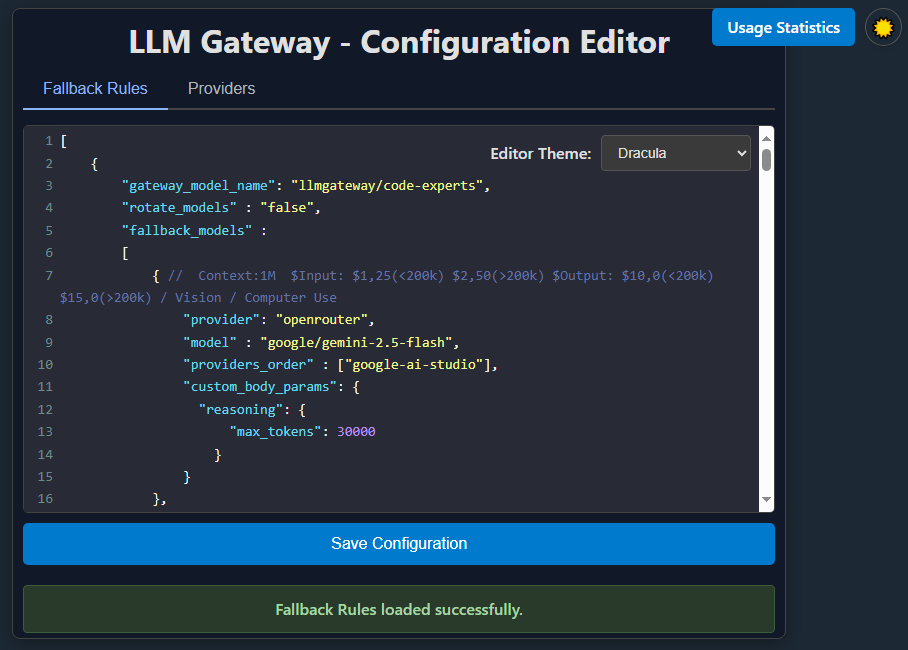
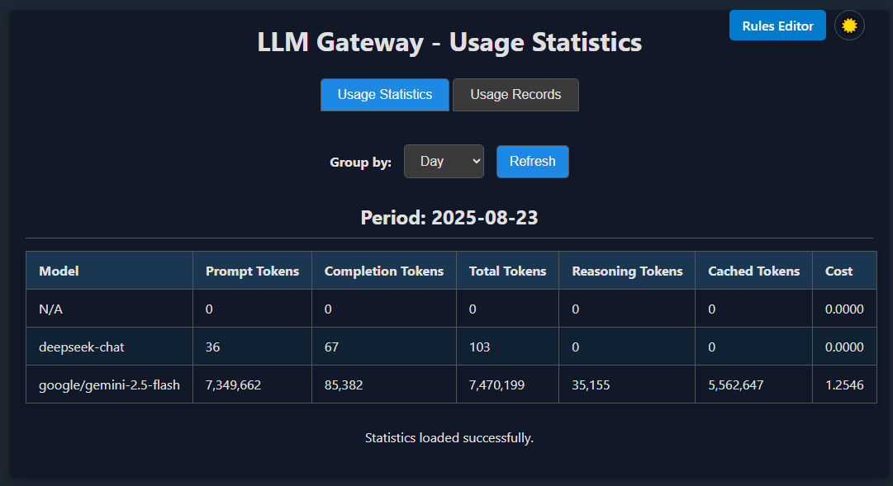
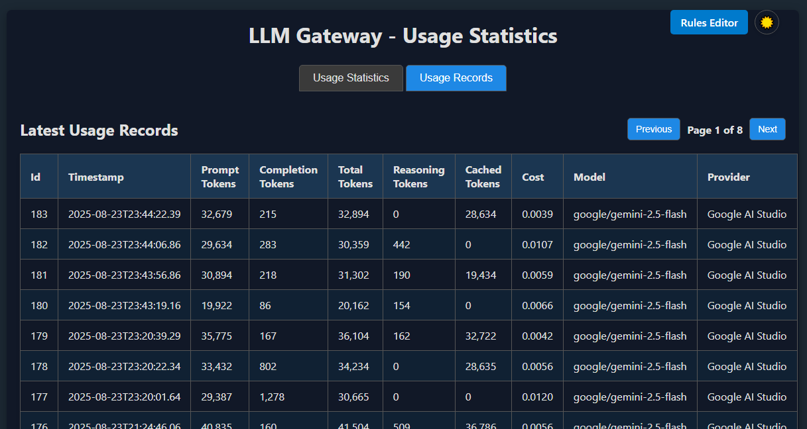
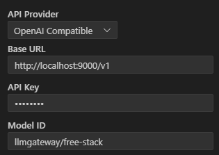

# Отказоустойчивый персональный LLM Gateway

[English version](README_EN.MD)

---
<div align="center" style="text-align: center;">
 &nbsp;
 <a href="https://openrouter.ai"></a>
 &nbsp;
 <a href="https://www.paypal.com/donate/?business=G47L9N4UW8C2C&no_recurring=1&item_name=Thank+you+%21%21%21&currency_code=USD"></a>
 <br>
 <a href="https://cline.bot/"></a>
 <a href="https://roocode.com/"></a>
 
</div>
<br>
 
Этот проект представляет собой персональный LLM Gateway, который позволяет разработчикам использовать LLM от разных провайдеров с такими возможностями, как отказоустойчивость, балансировка нагрузки между моделями, кастомизация запросов к моделям, повторные попытки вызова и многое другое.
LLM Gateway работает локально как OpenAI-совместимый LLM API-провайдер с расширенной поддержкой fallback-моделей на случай ошибок ответа.
Его можно использовать с кодовыми агентами вроде Cline и RooCode или со своими приложениями как обычный OpenAI-совместимый LLM API-провайдер.

## Возможности

- **Отказоустойчивость**: автоматически переключается на альтернативные модели, если основная модель недоступна.
- **Порядок провайдеров в OpenRouter**: позволяет задавать порядок провайдеров, через которых маршрутизирует OpenRouter.
- **Ротация моделей**: при необходимости циклически переключает доступные модели для каждого API-ключа, распределяя нагрузку и стоимость между провайдерами.
- **Гибкая конфигурация**: позволяет настраивать последовательности fallback и правила ротации для каждой модели.
- **Пользовательские параметры LLM**: позволяет задавать произвольные параметры запроса для любой модели.
- **Статистика использования**: отслеживает стоимость и расход токенов по часам, дням, неделям и месяцам. Отдельно суммируется поле `cost_saved` — экономия за счёт prompt-caching (если upstream возвращает `usage.cost_saved`/`saved_cost`, значение берётся как есть; иначе gateway делает консервативную оценку из `cached_tokens` и подразумеваемой ставки за prompt-токен).
- **Оценка токенов при обрыве стрима**: если провайдер не прислал финальный `usage`-блок (stream cancelled client-side, timeout и т.п.), gateway дооценивает `prompt_tokens`/`completion_tokens`/`reasoning_tokens` локально через `tiktoken` и помечает запись в БД флагом `is_estimated=1`. В UI такие записи показываются значком `≈` в колонке `Estimated`.
- **Retry-After + jitter**: при ретраях gateway уважает заголовок `Retry-After` downstream-ответа (delta-seconds или HTTP-date, clamp до 120с); иначе применяет к настроенному `retry_delay` jitter ±25%, что сглаживает thundering-herd при одновременных сбоях.
- **Временный cooldown upstream-ключа**: если chat-модель в fallback-цепочке получает временный сбой доступности (`429`, `5xx`, timeout/connect, `overloaded`, `rate_limit`, `try again later`), gateway помечает конкретный upstream API-ключ для пары `provider/model` на 10 минут и в следующих запросах выбирает другой доступный ключ без лишнего downstream-вызова. Метка хранится в памяти процесса и сбрасывается при рестарте.
- **Upstream routing state**: gateway ведёт in-memory состояние по `(provider, model, upstream key)`: read-only health (`healthy`/`invalid`/`error`), время последней проверки, последнюю ошибку, cooldown, RPM/RPD/TPM/TPD ledger и быстрые агрегаты success/latency/error. Это не меняет публичный `/health`; данные доступны master-пользователю через API и UI статистики.
- **Глобальный retry-бюджет**: в fallback-правиле можно задать поле `max_total_attempts` — предел на общее число попыток по всей цепочке, а не только на per-model `retry_count`. Если бюджет исчерпан, цепочка останавливается, даже если следующие модели ещё не попробованы. В UI поле доступно в блоке настроек chat-модели как `Max Total Attempts (chain budget)`.
- **Безопасная диагностика fallback**: dynamic penalty после `429`/`5xx` включается только явно на конкретном fallback-правиле и не меняет порядок маршрутов скрыто. Диагностические заголовки `X-Routed-Via` и `X-Fallback-Attempts` отключены по умолчанию и включаются через `ROUTING_DIAGNOSTIC_HEADERS=true`.
- **Проверка моделей на startup**: при старте gateway опционально ходит в `/models` каждого провайдера из `providers.json` и сверяет ответ с тем, что указано в fallback-/operation-правилах. Режим задаётся `VERIFY_MODELS_ON_STARTUP=off|warn|strict`: `warn` (по умолчанию) логирует отсутствующие модели как предупреждения, `strict` прерывает startup, `off` полностью отключает проверку.
- **Рейтинг бесплатных OpenRouter-моделей**: если настроен официальный провайдер `openrouter` и его API-ключ, gateway каждые 8 часов анализирует бесплатные text-модели OpenRouter. Для scoring можно указать несколько OpenRouter-ключей через запятую: при каждом запросе к OpenRouter выбирается следующий непустой ключ по round-robin. При изменении списка eligible-моделей выполняется полный скоринг по всем eligible-моделям без ограничения количества; lite eval пропускается только для моделей, которые не прошли health probe. Если список не изменился — обновляются health/latency для всех моделей и догоняется lite eval для тех, кто восстановился после неудачного health probe. Итоговый score считается как `round((metadataScore + healthScore + latencyScore - instabilityPenalty) * 0.8 + liteEvalScore * 1.6)` — eval-тесты весят вдвое больше остальных метрик, чтобы модель с большим контекстом, но проваленными тестами не обгоняла модель с реально работающими навыками. Lite eval проверяет instruction following, tool-call JSON, Python code с unit tests, параметризованную арифметику и factual QA. Результат отображается в read-only вкладке **OpenRouter Free** в `/v1/ui/rules-editor`; над рейтингом показана краткая расшифровка scoring-метрик. Кнопка `Run Full Eval` (или `POST /v1/openrouter/free-models/run`) запускает полную переоценку всех eligible моделей в фоне без ожидания следующего планового цикла; если переоценка уже идёт, endpoint возвращает `409`. Маршрутизация моделей пока не меняется автоматически.
- **Ручной eval fallback-моделей**: во вкладке **Fallback Eval** можно кнопкой запустить такой же lite eval по уникальным `provider/model` из настроенных `fallback_models` и `context_overflow_fallback`. Повторяющиеся цели схлопываются и показывают все gateway-модели, которые на них ссылаются. Если настроен официальный провайдер `openrouter` с API-ключом, gateway подтягивает OpenRouter catalog и сопоставляет metadata по basename модели: `openai/gpt-oss-120b:free` матчится с `gpt-oss-120b`; если для части целей metadata не нашлась, но есть известные OpenRouter-оценки других целей, используется медианный `metadataScore` из известных. Итоговый score считается как `round((metadataScore + healthScore + latencyScore - instabilityPenalty) * 0.8 + liteEvalScore * 1.6)` — eval-тесты весят вдвое больше остальных метрик, чтобы модель с большим контекстом, но проваленными тестами не обгоняла модель с реально работающими навыками; если OpenRouter не настроен или в запуске нет известных metadata-оценок, `metadataScore` остаётся 0. Lite eval запускается для всех доступных целей без ограничения количества. OpenAI-compatible fallback routes оцениваются через `/chat/completions`, native Anthropic routes — через `/v1/messages`; правила маршрутизации eval не меняет.
- **Virtual API keys**: помимо master-ключа `GATEWAY_API_KEY` теперь можно заводить отдельные виртуальные ключи через UI `/v1/ui/api-keys` (доступно только мастеру). Каждый ключ хранится в `db/api_keys.db` в открытом виде и имеет свой бюджет в USD, лимиты RPM/TPM и опциональный whitelist `allowed_models`. При исчерпании бюджета gateway отвечает `429`, при запрете модели — `403`. Виртуальные ключи могут авторизоваться через `Authorization: Bearer <lgk_...>` или `X-Api-Key`, и в UI видят только свою статистику, без доступа к настройкам. Master-ключ видит общий usage по всем обращениям. Если `budget_usd` не задан, бюджет не отслеживается.
- **Tool-schema compatibility shim**: перед отправкой запросов с `tools` downstream gateway автоматически нормализует JSON Schema-описания function-parameters (flattens `["string","null"]`, сворачивает `anyOf/oneOf` nullable-варианты в `nullable: true`, конвертирует draft-04 boolean `exclusiveMaximum/exclusiveMinimum` в draft-07 numeric, убирает `$schema`/`$id`/`$comment`). Это снимает характерные 400-ошибки на строгих OpenAI-compatible провайдерах и gRPC backends.


## Эндпоинты gateway

  - `/v1/models` - аналог v1, возвращает список доступных моделей. Для gateway-моделей, описанных в chat/embeddings/rerank/images/audio_speech/audio_transcriptions/pdf/web rules, ответ дополнительно включает `capabilities`, а также нормализованную metadata-разметку `type` и `architecture`, объединённые из соответствующих секций. Если запрос приходит в Anthropic-формате, endpoint сохраняет совместимое Anthropic-поле `type: "model"`, а gateway-маркер назначения модели отдаёт в дополнительном поле `gateway_type` вместе с теми же `capabilities` и `architecture`.
  - `/v1/chat/completions` - OpenAI-совместимый API, который маршрутизирует вызовы к другим провайдерам и использует fallback в случае ошибок. Playground включает простой Chat-режим для этого endpoint: он хранит локальный контекст до 20 сообщений и умеет сбрасывать историю кнопкой `Reset chat`.
  - `POST /v1/embeddings` - OpenAI Embeddings-совместимый API. Принимает поля `model`, `input`, `encoding_format`, `dimensions`, проксирует запрос в downstream provider согласно rules из `models_operation_rules.json`; несколько routes для одной gateway-модели используются как ordered fallback chain. Каждый route сначала отрабатывает собственные `retry_count`/`retry_delay`, а если downstream всё ещё возвращает ошибку `503` gateway-уровня, endpoint пробует следующий route. Rotation не поддерживается.
  - `POST /v1/rerank` - Rerank API. Принимает поля `model`, `query`, `documents` (`list[str]`), `top_n`, `return_documents`, маппит `query -> text_1` и `documents -> text_2`, отправляет запрос в `target_path` (по умолчанию `"/score"`); несколько routes для одной gateway-модели используются как ordered fallback chain. Каждый route сначала отрабатывает собственные `retry_count`/`retry_delay`, а следующий route пробуется только после `503` gateway-уровня, включая невалидный downstream rerank response. По умолчанию успешный downstream-ответ нормализуется к формату `{"data": [{"index": int, "score": float, "document"?: str}]}`. Если route-поле `response_output_format` задано как `jina_results`, gateway возвращает Jina-style формат `{"results": [{"index": int, "relevance_score": float, "document"?: str}]}`. Если `target_path` задан как абсолютный `http(s)` URL, gateway использует его как готовый downstream URL вместо склейки с `provider.baseUrl`. Для NVIDIA rerank-маршрутов gateway автоматически использует нативный payload `{"query":{"text": ...}, "passages":[{"text": ...}]}`. Для rerank-сервисов, которые ждут `{"query": ..., "texts": [...]}` и возвращают `{"scores": [...]}`, route можно настроить через `request_format: "query_texts"` и `response_format: "scores"`; gateway сопоставит score с исходным индексом документа и отсортирует результаты по score. Параметр `top_n` дополнительно обрезает список результатов, а `return_documents=true` возвращает исходные документы клиента по `index` или позиции.
  - `POST /v1/images` и `POST /v1/images/generations` - OpenAI Images generation-совместимые endpoint'ы. Они принимают JSON payload с `model`, `prompt` и параметрами генерации; несколько routes для одной gateway-модели используются как ordered fallback chain. Каждый route сначала отрабатывает собственные `retry_count`/`retry_delay`, а следующий route пробуется только после `503` gateway-уровня, включая downstream error status, сетевые ошибки, невалидный JSON или невалидный image response. Rotation и streaming не поддерживаются. По умолчанию route работает как OpenAI-compatible passthrough, но при необходимости может использовать mapping-based adapter через поля `request_format`, `response_format`, `request_mapping` и `response_mapping`.
  - `POST /v1/images/edits` - OpenAI Images edits-совместимый endpoint. Поддерживает как JSON body с `images`, так и `multipart/form-data` с файлами `image` / `image[]` и `mask`, подменяет `model` на route-модель; несколько routes для одной gateway-модели используются как ordered fallback chain после `503` gateway-уровня или downstream multipart `413 Payload Too Large`. Rotation не поддерживается, `stream=true` явно возвращает ошибку. По умолчанию JSON клиента уходит downstream как JSON, а multipart — как multipart; если edit-route задаёт `request_format: "openai_images_multipart"`, JSON body клиента конвертируется в downstream `multipart/form-data` для моделей, которые не принимают image edit JSON. Для downstream API с несовместимым wire-format, например NVIDIA image endpoints, edit-route тоже можно перевести на mapping-based adapter без изменения публичного OpenAI-совместимого API gateway.
  - `POST /v1/audio/speech` - OpenAI Audio Speech-совместимый endpoint. Принимает JSON с `model`, `input`, `voice`, `response_format`, `speed` и другими OpenAI-style параметрами, подменяет `model` на route-модель из секции `audio_speech` и возвращает raw audio bytes с downstream `content-type`. Fallback/rotation не поддерживаются; для одного route доступны только `retry_count` и `retry_delay`, а `stream=true` возвращает явный `400`.
  - `GET /v1/audio/voices` - список голосов для TTS. С query-параметром `model` возвращает голоса одной gateway-модели; без `model` возвращает общий JSON вида `gateway_model -> voices[]` по всем доступным моделям из `audio_speech` с учётом `allowed_models` virtual key. Gateway нормализует ответы downstream `voices` / `preset_voices` / `custom_voices`; если downstream отдаёт у голоса поле `model`, gateway фильтрует catalog по route-модели выбранной gateway-модели. Gateway добавляет известные `gender` и `language` для встроенных голосов Silero, а неизвестные голоса отдаёт только с понятными `id`, `name` и `source`.
  - `POST /v1/audio/transcriptions` - OpenAI Audio Transcriptions-совместимый endpoint. Принимает `multipart/form-data` с полями OpenAI-style (`file`, `model`, `language`, `prompt`, `response_format`, `temperature`, `timestamp_granularities[]` и т.д.), подменяет `model` на route-модель из `models_operation_rules.json`; несколько routes для одной gateway-модели используются как ordered fallback chain. Каждый route сначала отрабатывает собственные `retry_count`/`retry_delay`, а следующий route пробуется только после `503` gateway-уровня. Rotation не поддерживается, `stream=true` явно возвращает ошибку. По умолчанию route работает как OpenAI-compatible multipart passthrough, но `request_format: "nvidia_riva_grpc"` переключает только downstream transport: gateway по-прежнему принимает OpenAI-style multipart, а внутрь отправляет запрос в NVIDIA Riva gRPC / API Catalog. Для NVIDIA route неподдерживаемые OpenAI-поля клиента тихо игнорируются, а не ломают запрос. JSON-ответы gateway проксирует как JSON, а text/srt/vtt-подобные ответы возвращает как есть, чтобы сохранялась совместимость с официальным OpenAI SDK.
  - `POST /v1/pdf/convert`, `POST /v1/pdf/jobs`, `GET /v1/pdf/jobs/{job_id}`, `GET /v1/pdf/jobs/{job_id}/result`, `GET /v1/pdf/jobs/{job_id}/download/{artifact}` - gateway API для PDF-конвертера. `convert` и `jobs` принимают `multipart/form-data` с `file`, `model` и параметрами converter-сервиса, включая `target_language` для перевода перед сборкой DOCX/MD; `model` используется только для выбора gateway route и не отправляется downstream. Job status/result/download требуют `model` в query string, чтобы сохранить такую же проверку доступа по virtual key.
  - `POST /v1/web/search` - сервис поиска. Принимает `model`, `query`, опциональные `max_results`, `num_queries`, `language`, а также Tavily-compatible поля `include_raw_content`, `read_model`, `include_domains`, `exclude_domains`, `include_images`. Ответ сохраняет текущий формат `data[]`; при `include_raw_content` каждый результат получает `raw_content`, скачанный через локальный `/v1/web/read` pipeline включая платные adapter fallback, а при `include_images` каждый результат получает `images[]` из поискового адаптера и/или read pipeline (пустой массив, если pipeline не извлёк картинки). Virtual key проверяется на поисковую модель и, если запрошен `raw_content`, на `read_model`. Секция `web_search` теперь задаёт только имя сервиса (`gateway_model_name`) и опциональный `query_model` — chat-модель gateway для расширения пользовательского запроса в несколько поисковых. Сам поиск всегда идёт через четыре встроенных адаптера в фиксированном порядке: Proxy → Tavily → Jina → Z.AI. Адаптер активен только если заданы соответствующие переменные окружения (`PROXY_URL`, `TAVILY_API_KEY`, `JINA_API_KEY`, `ZAI_API_KEY`). Адаптеры пробуются по порядку, первый непустой ответ выигрывает; если заданы доменные фильтры, ответ adapter должен дать хотя бы один результат после фильтрации.
  - `POST /v1/web/read` - сервис чтения страницы по ссылке. Принимает `model`, `url`, опциональный `format`; проверяет virtual key только на `model` сервиса чтения. Секция `web_read` задаёт только имя сервиса. Перед обращением к встроенным адаптерам gateway всегда пытается keyless direct HTTP fetch (без API-ключей: для Medium сначала через Freedium mirror, затем исходный URL; `trafilatura` с сохранением links/images → fallback на встроенный HTML-парсер, извлечение PDF через `pdfminer`, субтитры YouTube через `youtube_transcript_api`). Direct pipeline best-effort добирает изображения из markdown, HTML, `srcset`, OpenGraph/Twitter meta и JSON-LD в `images[]`, но не дописывает отсутствующие картинки в markdown-контент и не падает, если часть изображений не извлеклась. Если прямая загрузка вернула пусто или упала, gateway делает ещё одну локальную попытку: рендерит страницу через CloakBrowser и извлекает Markdown через `trafilatura` с сохранением inline-картинок прямо в тексте. Только после этого по порядку пробуются те же четыре платных/внешних адаптера: Proxy → Tavily → Jina → Z.AI, каждый активен только при наличии соответствующей env-переменной; Tavily Extract вызывается с `include_images` и его отдельный список картинок дописывается inline в markdown-контент, Jina/Z.AI сохраняют картинки в markdown, а все adapter responses дополнительно парсятся на markdown image links.
  - `POST /v1/tavily/search` и `POST /v1/tavily/extract` - Tavily-compatible endpoints для клиентов, которые ожидают поля `results[]`, `failed_results[]`, `raw_content`, `images[]`, `response_time`, `usage`, `request_id`. Они используют те же gateway-модели и тот же search/read pipeline, но возвращают Tavily-style shape вместо `data[]` / `content`.
  - `POST /v1/web/research` - сервис исследования. Принимает `model`, `query`, опциональные `max_results_per_lang` (алиас: `max_results`), `max_articles`, `num_queries`, `language`, `output_language` и `format`; проверяет virtual key только на внешний сервисный `model`, затем использует настроенные `search_model`, `read_model`, `rerank_model` и `analysis_model` внутри gateway. Если параметры не переданы, поиск запускается сразу на трёх языках: `ru` (2 запроса), `en` (3 запроса), `zh` (3 запроса), скачивает кандидатов из выдачи, ранжирует уже скачанные статьи по заголовку и полному тексту, берёт до 8 лучших статей на каждый язык и параллельно анализирует их. Финальный `output` дополнительно синтезируется через `analysis_model` в единый связный текст на языке `output_language` (по умолчанию `ru`). Для запросов выбора, сравнения, рекомендаций, shortlist и due diligence gateway автоматически строит `evidence_matrix`: `analysis_model` определяет обязательные признаки и извлекает доказательства из найденных источников, а код детерминированно пропускает только кандидатов с подтверждёнными обязательными признаками. Если режим применим, ответ дополнительно содержит `evidence_matrix`; для обычных исследовательских запросов поле не добавляется.
  - `POST /v1/web/deep-research` - сервис глубокого исследования через внешний пакет `gpt-researcher`. Принимает `model`, `query`, опциональные `max_words`, `breadth`, `depth`, `concurrency`, `language`, `format`, `image_generation`; `concurrency` по умолчанию равен 6, `language` задаёт язык итогового отчёта, а не язык поиска. Virtual key проверяется только на сервисную модель `web_deep_research`, а GPT Researcher получает search/read, LLM/embedding/image-модели из секции `web_deep_research` и ходит в gateway как в OpenAI-compatible API.
  - Для `/v1/web/research` и `/v1/web/deep-research` gateway явно отслеживает отключение клиента после чтения тела запроса: активная research-фаза отменяется, а deep-research дополнительно сигналит worker thread о кооперативной отмене.
  - `/v1/responses` - OpenAI Responses-совместимый API. Принимает payload в стиле `input` / `instructions` / `text.format` / `tools` и переводит его во внутренний OpenAI Chat payload для существующего routing слоя, а затем конвертирует ответ обратно в Responses-format.
  - `/v1/messages` - Anthropic Messages-совместимый API. На вход принимает Anthropic-format, внутри переводит его в OpenAI-style payload для существующего routing слоя и возвращает ответ обратно в Anthropic-format. Подходит для официального `anthropic` SDK в режимах `messages.create(...)`, `messages.stream(...)` и `messages.count_tokens()`.

  Поле `capabilities` в `/v1/models` возвращается только для gateway-моделей, определённых в chat rules и/или operation routes. Типичные значения: `["chat"]`, `["embeddings"]`, `["rerank"]`, `["images"]`, `["audio_speech"]`, `["audio_transcription"]`, `["pdf_conversion"]`, `["web_search"]`, `["web_read"]`, `["web_research"]`, `["web_deep_research"]`, а если одна и та же gateway-модель присутствует сразу в нескольких секциях, gateway возвращает объединённый список, например `["chat", "embeddings"]`. Для gateway-моделей endpoint также добавляет top-level поле `type` (`text`, `embeddings`, `rerank`, `image`, `audio`, `document`, `web`) и блок `architecture` с `input_modalities` / `output_modalities`; при нескольких capability одновременно `type` опускается, чтобы не врать о единственном назначении модели. Для image-моделей gateway дополнительно возвращает `image_operations` (`["generation"]`, `["edit"]` или оба режима), а для edit-route в `architecture.input_modalities` дополнительно появляется `image`. Для web-моделей gateway дополнительно возвращает `web_operations` (`["search"]`, `["read"]`, `["research"]` или `["deep_research"]`). Для audio speech-моделей `architecture.input_modalities` содержит `text`, а `architecture.output_modalities` содержит `audio`; для audio transcription-моделей вход — `audio`, выход — `text`; для PDF-конвертера вход и выход — `document`. В Anthropic-совместимом ответе поле `type` остаётся равным `"model"` по схеме Anthropic, поэтому нормализованный gateway-тип переносится в `gateway_type`, а `capabilities`, `architecture`, `image_operations` и `web_operations` сохраняются. Raw-модели fallback-провайдера продолжают возвращаться без изменения существующей логики и могут не содержать `capabilities`, `type`, `gateway_type`, `architecture`, `image_operations` или `web_operations`.

  
  **КЛЮЧЕВАЯ ВОЗМОЖНОСТЬ (Chat Completions):** эндпоинт `/v1/chat/completions` позволяет задавать последовательность fallback-моделей, которые будут вызываться в случае сбоя, включая поддержку повторных попыток. Например, если ответ от одной модели не получен, gateway может повторить вызов той же модели или автоматически перейти к следующей модели в цепочке fallback и так далее. Последовательность может состоять из разных моделей и разных провайдеров. Например, первой моделью в цепочке может быть deepseek-chat из OpenRouter, а при ошибке gateway можно настроить на fallback к gpt-4o из OpenAI. Такая цепочка может быть любой длины и настраивается в файле `models_fallback_rules.json` вручную или через веб-редактор.

  **OpenAI Responses compatibility:** эндпоинт `/v1/responses` совместим с OpenAI Responses-style клиентами, которые отправляют `input`, `instructions`, `tools`, `tool_choice`, `text.format`, `max_output_tokens` и `stream` вместо классического `messages`. Gateway переводит message-элементы `input`, а также `function_call` / `function_call_output`, во внутренний OpenAI Chat payload и использует тот же fallback/routing механизм, что и для `/v1/chat/completions`. На выходе обычные JSON-ответы и SSE-стримы преобразуются обратно в Responses-format, включая `function_call` элементы и `response.function_call_arguments.delta` stream events для tool-calling сценариев.

  **Anthropic Messages compatibility:** эндпоинт `/v1/messages` совместим с официальным `anthropic` SDK для `messages.create(...)`, `messages.stream(...)` и `messages.count_tokens()`. Gateway принимает стандартные заголовки `X-Api-Key: <GATEWAY_API_KEY>` и `anthropic-version`, а также продолжает принимать `Authorization: Bearer <GATEWAY_API_KEY>` для прямых вызовов. Поля `messages`, `system`, `max_tokens`, `temperature`, `top_p`, `top_k`, `metadata`, `stop_sequences`, `stream`, `tools`, `tool_choice`, `cache_control`, `container`, `inference_geo`, `output_config`, `service_tier` и `thinking` переводятся во внутренний OpenAI-style payload, после чего используется тот же fallback/routing механизм, что и для `/v1/chat/completions`. Поддерживаются assistant-блоки `text`, `thinking`, `redacted_thinking`, `tool_use`, user-блоки `text`, `image`, `document`, `tool_result`. На выходе gateway преобразует обычные JSON-ответы и SSE-стримы обратно в Anthropic-совместимый формат, включая `tool_use` events. Для обычного JSON-ответа неподписанный downstream reasoning не публикуется как Anthropic `thinking`, потому что Anthropic требует `signature`/`signature_delta` для таких блоков. `messages.count_tokens()` возвращает локальную gateway-side оценку `input_tokens` по уже переведённому payload и не делает отдельный сетевой вызов к провайдеру.

  Для chat-запросов с `response_format: {"type": "json_object"}` gateway дополнительно снимает случайную markdown-обёртку вида ```` ```json ... ``` ```` или префикс `json`, если внутри находится валидный JSON-объект. Если модель перед JSON выводит reasoning-блоки в тегах `<think>...</think>`, gateway тоже вырезает их из JSON-ответа. Для обычных JSON-ответов эти очистки выполняются целиком над `message.content`. Для SSE-стримов gateway вырезает `<think>...</think>` по мере прихода text-delta чанков, затем убирает стартовый ` ```json`/`json` и финальный ` ``` ` из хвоста потока, не буферизуя весь ответ целиком. Это поведение применяется к `/v1/chat/completions`, а также к совместимым `/v1/responses` и `/v1/messages`, которые используют тот же routing layer.
  Для обычных текстовых chat-ответов и SSE-стримов literal-блоки `<think>...</think>` можно включать или выключать на уровне gateway-модели через поле fallback-правила `strip_think_tags`. Если оно равно `true`, gateway вырезает такие блоки из `message.content` и из streaming `delta.content`; если `false`, текст сохраняется как пришёл от провайдера. Для нативных Anthropic-ответов (`/v1/messages` через провайдер типа `anthropic`, когда ответ отдаётся в Anthropic-форме без OpenAI-конвертации) стрип применяется в их собственном формате: из текстовых блоков `content` non-stream ответа и из `content_block_delta` (text-delta) SSE-потока. JSON-object санация выше остаётся обязательной для сохранения валидного JSON-контракта.


## Конфигурация

### Редактирование провайдеров и fallback-правил
Перед началом работы с LLMGateway нужно заполнить список провайдеров и моделей с их fallback-правилами. Для этого откройте страницу конфигурации в браузере: http://localhost:9000/v1/ui/rules-editor. Ниже описано, как должны быть устроены эти правила.
Браузерный вход теперь идёт через отдельную страницу `/auth/login`. Если открыть `/` без авторизации, gateway перенаправит на `/auth/login`; если валидная авторизация уже есть, `/` перенаправит на `/v1/ui/usage-stats`. После успешного входа сервер создаёт долговечную подписанную HttpOnly cookie, и браузерный UI использует уже её, а не `sessionStorage`; эта cookie сохраняется между перезапусками браузера и самого gateway, пока вы явно не выйдете или не изменится `GATEWAY_API_KEY`. Для SDK и прямых API-вызовов по-прежнему поддерживается заголовок `Authorization: Bearer <GATEWAY_API_KEY>`, а для `/v1/messages` дополнительно принимается `X-Api-Key: <GATEWAY_API_KEY>` вместе со стандартным заголовком `anthropic-version` официального SDK. Gateway разбирает Bearer-заголовок строго как `scheme + token`, разделённые пробелами, принимает `Bearer` без учёта регистра, возвращает `401` для некорректного формата или отсутствующей авторизации и возвращает `403` только в случае, когда формат заголовка корректен, но значение токена неверно. Публичными остаются только `/health`, `/auth/login`, `/` как redirect-entrypoint и статические assets под `/static/`. HTML-страницы без cookie или Bearer-токена перенаправляются на login, а API-эндпоинты без валидной авторизации продолжают отвечать `401/403`. Незарегистрированные маршруты по-прежнему отдают стандартный `404`.
Редактор конфигурации включает основные вкладки:
- **Fallback Rules**: структурированная форма для управления цепочками fallback для чат-моделей.
- **Embeddings**: структурированная форма для управления маршрутами `/v1/embeddings`.
- **Rerank**: структурированная форма для управления маршрутами `/v1/rerank`.
- **Images**: структурированная форма для управления маршрутами `/v1/images`, `/v1/images/generations` и `/v1/images/edits`.
- **Audio**: структурированная форма для управления маршрутами `/v1/audio/speech` и `/v1/audio/transcriptions`; секция `pdf_conversions` сохраняется структурированным API, но пока редактируется через JSON.
- **Web**: структурированная форма для управления сервисами `/v1/web/search`, `/v1/web/read`, `/v1/web/research` и `/v1/web/deep-research`.
- **OpenRouter Free**: read-only рейтинг бесплатных text-моделей OpenRouter. Lite eval включает instruction following, tool-call JSON, Python code с unit tests, параметризованную арифметику и factual QA. Вкладка показывается только если настроен официальный провайдер `openrouter` и его API-ключ; правила маршрутизации она автоматически не меняет. Кнопка `Run Full Eval` запускает полноценную переоценку всех eligible моделей в фоне (`POST /v1/openrouter/free-models/run`) без ожидания следующего планового цикла.
- **Fallback Eval**: read-only ручной eval уникальных fallback-целей из `models_fallback_rules.json`. Запускается кнопкой, показывает health/latency/lite-eval score и не сохраняет конфигурацию.
- **Providers**: структурированная форма для управления провайдерами: имя, `baseUrl`, `apikey`, тип API (`openai`/`anthropic`), опциональный `proxy` и JSON-поле `models`.

Вкладки Fallback Rules, Embeddings, Rerank, Images, Audio, Web и Providers используют структурированную форму вместо сырого JSON. Вкладки OpenRouter Free и Fallback Eval только показывают текущие snapshots и не сохраняют конфигурацию.
Во вкладке Fallback Rules доступны read-only `Preview Changes` и `Suggest Eval Order`: они показывают diff/предложенный порядок по текущему eval, но не сохраняют и не переставляют маршруты автоматически. Для каждого chat-правила можно отдельно включить `dynamic_penalty`, чтобы после временных upstream-ошибок gateway временно предпочитал менее штрафованные ключи/маршруты.
Список моделей выбранного провайдера запрашивается лениво, сортируется по алфавиту с natural numeric order и кэшируется на 15 минут. Во вкладке Fallback Rules ручной ввод модели не поддерживается. Во вкладках Embeddings, Rerank, Images и Audio вы можете либо выбрать модель из списка, либо ввести её вручную, если это необходимо.
**Скоринг настроенных fallback-моделей** находится во вкладке **Fallback Eval**. Он запускается вручную кнопкой `Run Eval`, берёт все `fallback_models` и `context_overflow_fallback` из `models_fallback_rules.json`, схлопывает повторы до уникальных пар `provider/model` и показывает, какие gateway-модели ссылаются на каждую цель. Если настроен официальный провайдер `openrouter` с API-ключом, eval один раз загружает `{openrouter.baseUrl}/models`, берёт OpenRouter-карточку по basename модели без provider prefix и без суффикса после `:`, например `openai/gpt-oss-120b:free` -> `gpt-oss-120b`, и копирует из неё `metadataScore`, context, max completion tokens, pricing и support-флаги. Если у цели нет OpenRouter metadata-match, но у других fallback-целей в том же запуске есть известные metadata-оценки, недостающий `metadataScore` оценивается как медиана этих известных score; детальные поля OpenRouter вроде context и pricing для такой цели остаются пустыми. Для OpenAI-compatible провайдеров eval отправляет запросы напрямую в `{baseUrl}/chat/completions`, учитывает `custom_headers` (кроме security-заголовков), `custom_body_params`, `providers_order`, provider-specific proxy clients и round-robin выбор ключей, если в `apikey` указано несколько ключей через запятую. Для провайдеров `type: "anthropic"` eval отправляет нативные запросы в `{baseUrl}/v1/messages` с `x-api-key` и `anthropic-version`, а затем приводит ответ к внутренней форме для тех же проверок.
Итоговый score для Fallback Eval считается как `round((metadataScore + healthScore + latencyScore - instabilityPenalty) * 0.8 + liteEvalScore * 1.6)` — eval-тесты весят вдвое больше остальных метрик, чтобы модель с большим контекстом, но проваленными тестами не обгоняла модель с реально работающими навыками; если OpenRouter не настроен или в текущем запуске нет ни одной известной metadata-оценки, `metadataScore` остаётся 0. `healthScore` берётся из короткого probe-запроса `Reply with exactly OK`, `latencyScore` — из скорости этого probe, `liteEvalScore` — из instruction following, tool-call JSON, Python unit test, параметризованной арифметики и factual QA. Lite eval запускается по всем доступным fallback-целям без ограничения количества; недоступные модели получают health/error status и не проходят lite eval. Результат хранится как runtime snapshot, доступен через `GET /v1/fallback-model-evals`, запускается через `POST /v1/fallback-model-evals/run` и не меняет правила маршрутизации автоматически.

### Eval-тесты моделей

OpenRouter Free и Fallback Eval используют один и тот же набор text-only проверок. Сначала выполняется health-probe: модель получает короткий запрос `Reply with exactly OK` с небольшим лимитом ответа. Если ответ содержит `OK`, цель получает `healthStatus=passed` и 400 health-баллов; если HTTP-вызов успешен, но ответ не совпал с ожидаемым, цель получает `healthStatus=imperfect` и 250 health-баллов. HTTP 429 считается временным rate-limit: цель получает `healthStatus=http_429`, 100 health-баллов и `instabilityPenalty=25`, но lite eval для неё не запускается, чтобы не усиливать rate-limit. Lite eval запускается только для `passed` и `imperfect`; остальные HTTP-ошибки, отсутствующий провайдер или сетевые ошибки получают `not_evaluated`.

Lite eval даёт максимум 750 баллов и состоит из пяти задач:

- `instruction_following_lite` — максимум 200 баллов. Модель должна вернуть ровно 4 строки: `STATUS: READY`, строку со словом `ROUTER` ровно два раза, JSON `{"mode":"eval","count":3}` и строку `DONE`, без markdown и лишнего текста.
- `tool_call_lite` — максимум 200 баллов. Модель получает список доступных инструментов и пользовательскую просьбу создать bug ticket. Оценивается, что она вернула JSON с инструментом `create_ticket`, high-priority, assignee `Ana`, due date `2026-05-12` и правильным смыслом title.
- `code_unit_lite` — максимум 200 баллов. Модель должна вернуть JSON с Python-функцией `sum_even_squares(nums: list[int]) -> int`. Код проверяется на наличие, безопасный AST без импортов и опасных конструкций, затем запускается локальный unit test.
- `symbolic_math_lite` — максимум 100 баллов. Модель решает параметризованную арифметическую задачу про оставшиеся страницы в notebook и должна вернуть только целое число.
- `simpleqa_lite` — максимум 50 баллов. Модель отвечает на factual QA: кто написал роман `The Left Hand of Darkness`. Правильный ответ `Ursula K. Le Guin` даёт 50 баллов, явный `UNKNOWN` даёт 20 баллов, неверный ответ — 0.

Во вкладке Images в advanced options теперь можно выбрать `request_format` / `response_format` и задать `request_mapping` / `response_mapping`. Это позволяет оставлять OpenAI-format по умолчанию, включать `openai_images_multipart` для JSON→multipart image edit routes или настраивать vendor-specific image routes, например NVIDIA image generation/edit endpoints, без отдельного хардкода под провайдера.
Во вкладке Audio можно задавать `provider`, `model`, `target_path`, `retry_count`, `retry_delay`, `custom_headers` и `custom_body_params` для TTS routes и OpenAI-compatible transcription routes. Для TTS routes также доступен `voices_target_path`, который использует `/v1/audio/voices`; по умолчанию downstream path для речи — `"/audio/speech"`, а каталог голосов использует `"/voices"`, если поле не заполнено. Для transcription routes дополнительно доступен `request_format`; по умолчанию `target_path` равен `"/audio/transcriptions"`.
Для NVIDIA downstream добавьте `request_format: "nvidia_riva_grpc"`. Публичный API gateway всё равно останется OpenAI-совместимым `/v1/audio/transcriptions`, но внутрь запрос уйдёт в NVIDIA Riva gRPC. Для NVIDIA API Catalog (`build.nvidia.com`) gateway использует официальный gRPC endpoint `grpc.nvcf.nvidia.com:443`; в `custom_headers` для такого route нужно передать `function-id`. В `custom_body_params` можно задавать NVIDIA-специфичные поля вроде `language`, `enable_automatic_punctuation`, `verbatim_transcripts`, `max_alternatives`, `custom_configuration`, `boosted_lm_words`, `boosted_lm_score`, `speaker_diarization`. Если клиент не передал `language`, gateway пытается вывести безопасный provider-driven default из upstream capabilities: сейчас автоподстановка выполняется только для агрегирующих кодов `multi` или `indic`, если их advertises сам NVIDIA API Catalog function; иначе endpoint возвращает явную ошибку со списком supported language codes. Для API Catalog gateway также сам выбирает transport-режим по upstream capabilities: если function advertises offline inference, используется offline RPC; иначе остаётся streaming RPC. Если в NVIDIA route приходит не-WAV аудио, gateway локально конвертирует его в WAV через `ffmpeg`, затем извлекает raw PCM и отправляет его в Riva с `RecognitionConfig.encoding = LINEAR_PCM`.
Если во вкладке Fallback Rules одна из уже сохранённых fallback-моделей больше не возвращается провайдером, редактор всё равно откроет правило и подсветит конкретную недоступную модель как unavailable. Сохранение при этом останется заблокированным, пока вы не выберете доступную модель из текущего списка.
Вкладка Fallback Rules работает через Structured API `/v1/config/models-rules/structured`. Для каждой gateway-модели там также доступен toggle `Strip <think> tags from replies`, который управляет вырезанием literal `<think>...</think>` в обычных и streaming chat-ответах. Вкладки Embeddings, Rerank, Images, Audio и Web используют Structured API `/v1/config/model-operations/structured`, который читает и сохраняет секции `embeddings`, `rerank`, `images_generations`, `images_edits`, `audio_speech`, `audio_transcriptions`, `pdf_conversions`, `web_search`, `web_read`, `web_research` и `web_deep_research` без перезапуска сервера. Через UI редактируются Embeddings, Rerank, Images, Audio Speech, Audio Transcriptions и Web-секции; `pdf_conversions` сохраняется при таких изменениях, но остаётся JSON-only. Вкладка Providers использует Structured API `/v1/config/providers/structured`; при сохранении она по-прежнему валидирует `${VAR}`-ссылки, проверяет, что удаление или переименование провайдера не ломает fallback/operation rules, обновляет runtime-конфиг и сбрасывает кэш списков моделей. Web-вкладка настраивает четыре сервиса: поиск, чтение страницы, исследование и глубокое исследование с моделями GPT Researcher, embedding и image-generation. При сохранении отдельной operation-вкладки редактор перечитывает актуальный operation-config и заменяет только сохраняемую секцию, чтобы не перетирать изменения в других секциях. Поле `retry_delay` сохраняется как дробное число, если вы указали значение вроде `0.5`.
После загрузки сохранённые карточки Embeddings, Rerank, Images, Audio, Web и Providers показываются в виде свёрнутых аккордеонов; при создании новой карточки она автоматически раскрывается для редактирования.

Если вы запускаете gateway через `docker-compose.yml`, смонтированные файлы `providers.json`, `models_fallback_rules.json` и `models_operation_rules.json` доступны на запись внутри контейнера. Изменения, внесённые в веб-редакторе, сохраняются обратно в файлы на хосте.



## Статистика использования
На странице http://localhost:9000/v1/ui/usage-stats можно посмотреть статистику использования.

Вкладка **Analytics Dashboard** показывает сводный дашборд по выбранному периоду: KPI по запросам, токенам, стоимости, `cost_saved`, средней длительности, активным запросам, fallback-ошибкам и отказам доступа; график токенов во времени; график стоимости по провайдерам; таблицы по resolved target, `X-Title`, reliability, виртуальным ключам и последним запросам. Дашборд работает через `GET /v1/api/analytics-dashboard` и поддерживает фильтры `range` (`24h`, `7d`, `14d`, `30d`, `90d`, `180d`, `365d`, `12m`), `bucket` (`hour`, `day`, `week`, `month`), `api_key_scope=unattributed`, `operation`, `gateway_model`, `provider`, `model`, `x_title`, `upstream_key_fingerprint`, `usage_source` и `estimated`. Исторические usage-строки с неполными `gateway_model`/`provider`/`model` не отбрасываются из этого дашборда, а группируются как `unknown`.

**Примечание**: страница статистики теперь учитывает успешные вызовы `/v1/chat/completions`, `/v1/responses`, `/v1/messages` (Anthropic), `/v1/embeddings`, `/v1/rerank`, `/v1/images`, `/v1/images/generations`, `/v1/images/edits`, `/v1/audio/speech`, `/v1/audio/transcriptions`, `/v1/pdf/convert`, `/v1/pdf/jobs`, `/v1/web/search`, `/v1/web/read`, `/v1/web/research` и `/v1/web/deep-research`. Для embeddings, rerank, image-, audio-, PDF- и web-операций gateway тоже пишет запись в statistics даже если downstream не вернул блок `usage`; в таком случае токеновые поля останутся нулевыми, но счётчик вызовов и metadata маршрута будут видны. Для других провайдеров значения токенов и стоимости всё равно могут оставаться пустыми или нулевыми, если их API не возвращают статистику по токенам или возвращают её в несовместимом формате. Локальный endpoint `/v1/messages/count_tokens` в usage-статистику не попадает.
Сбор usage-статистики выполняется независимо от `LOG_CHAT_ENABLED`. Переменная `LOG_CHAT_ENABLED` управляет только записью подробных chat-логов в директорию `logs/`.
В usage statistics первая колонка `Gateway Model` показывает исходную модель gateway, рядом колонка `Resolved Model` показывает полный фактически выбранный target в формате `provider/model`, например `devbox/zai.glm-5`, а колонка `Operation` показывает тип вызова (`chat` для OpenAI `/v1/chat/completions` и `/v1/responses`, `messages` для Anthropic `/v1/messages`, `embeddings`, `rerank`, `images_generation`, `images_edit`, `audio_speech`, `audio_transcription`, `pdf_conversion`, `web_search`, `web_read`, `web_research`, `web_deep_research`). Исторические записи, сделанные до этой правки, могут по-прежнему показывать `N/A` в `Gateway Model` или `Operation`, если в базе для них ещё не были сохранены `gateway_model` и `operation`.
Для fallback-ошибок c `response_format: {"type": "json_object"}` gateway теперь добавляет в `error_message` ещё и `system_preview` — первые 100 символов первого `system`-сообщения. Это помогает быстрее диагностировать кейсы, где downstream ждёт явное упоминание JSON в инструкциях, а полный prompt при этом остаётся скрыт.
Во вкладке **Latest Usage Records** колонка `Timestamp` показывает дату и время запроса в том же формате, что и **Fallback Chains**: `YYYY-MM-DDTHH:MM:SS`, без микросекунд. Колонка `X-Title` показывает одноимённый входящий HTTP-заголовок клиента, например значение из OpenAI SDK `extra_headers`. Запущенные запросы показываются вверху таблицы и выделяются цветом; после завершения они заменяются обычными usage-записями.
Там же колонка `Duration (ms)` показывает полную длительность обработки запроса gateway в миллисекундах. Для старых записей, созданных до добавления этого поля, значение может быть `N/A`.
Автоочистка usage-статистики запускается раз в сутки и удаляет записи старше 90 дней.

### Virtual API keys
Страница http://localhost:9000/v1/ui/api-keys (доступна только мастеру под `GATEWAY_API_KEY`) позволяет создавать, редактировать и удалять виртуальные API-ключи с префиксом `lgk_`. Каждый ключ может иметь:

- `budget_usd` — лимит расходов в долларах. `null` = без лимита. Принимаются только конечные неотрицательные значения; `NaN`, `Inf` и отрицательные значения отклоняются с `400` ещё до записи в БД. Как только `spent_usd >= budget_usd`, gateway отвечает `429` на любые LLM-запросы этого ключа. Чтобы параллельные и стриминговые запросы не могли пробить лимит, gateway держит in-memory ledger резервов на ключ: каждая попытка сначала бронирует консервативную оценку стоимости, и бронь освобождается уже после того, как `chat_logging` зафиксировал фактическое списание. Это закрывает гонку, когда несколько запросов летят одновременно и каждый видит ещё не обновлённый `spent_usd`.
- `rpm` / `tpm` — скользящее окно 60 секунд, хранится in-process. При превышении возвращается `429` с пояснением, какой именно лимит упёрся.
- `allowed_models` — whitelist имён gateway-моделей. Пустой список = доступ к любым моделям; непустой список — только к перечисленным. Этот список также фильтрует `/v1/models` и `GET /v1/models/{id}`: виртуальный ключ видит только разрешённые модели, а попытка запросить одиночную недоступную модель возвращает `403`. Master-ключ `GATEWAY_API_KEY` ограничениям не подчиняется и всегда видит полный каталог.
- `disabled` — мгновенно блокирует ключ без удаления. Заблокированные ключи возвращают одинаковый `403` с `detail="api_key_disabled"` и для Bearer/`X-Api-Key`, и для UI-сессии (без редиректа на login), чтобы поведение API и браузера оставалось симметричным.
- `metadata` — произвольный JSON-объект, удобно хранить owner/team/tag. Размер сериализованного значения ограничен 16 KB; превышение лимита возвращает `400`, и изменение не записывается.
- `budget_period` — периодический сброс счётчика `spent_usd`. Допустимые значения:
  - `none` (по умолчанию) — кумулятивный режим; `spent_usd` только растёт (историческое поведение).
  - `daily` — `spent_usd` сбрасывается в 0 каждый день в 00:00 UTC.
  - `monthly` — `spent_usd` сбрасывается в 0 первого числа каждого месяца в 00:00 UTC.
  Момент следующего сброса хранится в поле `budget_reset_at` (ISO-8601 UTC; вычисляется автоматически, при `none` — `null`). Фактический сброс выполняется фоновой задачей, которая проверяет наступление границы примерно раз в минуту, поэтому он происходит в пределах минуты от запланированного момента UTC. При изменении `budget_period` поле `budget_reset_at` пересчитывается автоматически. Настраивается через выпадающий список **Budget reset period** в Web-UI «API Keys», а также через Admin API.

Владельцы виртуальных ключей при логине в UI видят только `/v1/ui/usage-stats` со статистикой по собственным вызовам; вкладки **Fallback Analytics**, **Rules Editor** и **API Keys** для них скрыты, а master-only API-эндпоинты отвечают `403`. Query-параметр `api_key_id` в usage endpoints не ограничивает master-ключ: master всегда видит общий usage по всем ключам, а virtual-key сессии всегда принудительно ограничены собственным ключом. В **Analytics Dashboard** master может отдельно посмотреть неатрибутированные строки через `api_key_scope=unattributed`. Списание `spent_usd` привязано к `api_key_id` и идёт через тот же `WriteBatcher`, что и основная таблица usage.

На странице `/v1/ui/api-keys` master-админ управляет виртуальными ключами и их лимитами. Usage-статистика для master доступна как общий обзор на `/v1/ui/usage-stats`; per-key usage-фильтр для master не применяется.

CRUD над виртуальными ключами доступен через Admin API (master-only):
- `GET /v1/admin/api-keys` — список всех ключей вместе со значениями `api_key`, `spent_usd`, `last_used_at`, `budget_period`, `budget_reset_at`.
- `POST /v1/admin/api-keys` — создать новый ключ; принимает необязательное поле `budget_period` (`none`/`daily`/`monthly`); ответ содержит `api_key`, `budget_period` и `budget_reset_at`, полный ключ также виден master-админу в списке и карточке редактирования.
- `PATCH /v1/admin/api-keys/{id}` — частичное обновление полей ключа, включая `reset_spent: true` для обнуления счётчика и `budget_period` для изменения периода сброса; ответ содержит обновлённые `budget_period` и `budget_reset_at`.
- `DELETE /v1/admin/api-keys/{id}` — удаление ключа.
- `GET /v1/admin/rejections` — список governance-отказов шлюза (только master-ключ). Query-параметры:
  - `api_key_id` (int, опционально) — фильтр по ID виртуального ключа.
  - `category` (string, опционально) — фильтр по категории: `auth_invalid`, `key_disabled`, `model_not_allowed`, `budget_exhausted`, `rate_limited`, `master_only`, `unauthorized`.
  - `since` (ISO 8601 string, опционально) — записи начиная с указанного момента.
  - `limit` (int, по умолчанию 50, максимум 200) — лимит записей в ответе.
  - `offset` (int, по умолчанию 0) — смещение для постраничной выборки (используется UI-страницей).
  Ответ: `{"items": [...], "total": <кол-во по фильтру>}`. Каждый элемент: `id`, `timestamp`, `request_id`, `api_key_id`, `path`, `method`, `client_ip`, `status_code`, `category`, `reason`, `auth_source`, `x_title`.

### Аудит отклонений (Rejections Audit UI)
Страница http://localhost:9000/v1/ui/rejections (только master под `GATEWAY_API_KEY`) показывает журнал governance-отказов шлюза поверх `GET /v1/admin/rejections`. Таблица отображает время, категорию (цветной бейдж), HTTP-статус, метод, путь, ID ключа, входящий `X-Title`, client IP и причину. Доступны фильтры по категории, ID ключа и моменту начала (`since`), выбор размера страницы (25/50/100/200) и постраничная навигация (Newer/Older) через `offset`. Назначение — выявлять перебор ключей и зондирование, диагностировать, почему клиент блокируется (`model_not_allowed`/`budget_exhausted`/`rate_limited`), и вести аудит решений шлюза независимо от логов провайдера. Пункт **Rejections** в верхней навигации виден только master-ключу.

### Gateway Documentation UI
Страница http://localhost:9000/v1/ui/docs доступна любому авторизованному пользователю и описывает, как подключаться к gateway-моделям через публичные API. Она показывает текущие gateway-модели из `models_fallback_rules.json` и `models_operation_rules.json`, группирует их по capabilities (`chat`, `embeddings`, `rerank`, `images`, `audio_speech`, `audio_transcription`, `pdf_conversion`, `web_*`) и не делает сетевых запросов к downstream-провайдерам. Для virtual key с `allowed_models` каталог показывает только разрешённые gateway-модели.

На странице отдельно расписаны параметры вызовов для `/v1/rerank`, `/v1/embeddings`, `/v1/images*`, `/v1/audio/speech`, `/v1/audio/voices`, `/v1/audio/transcriptions`, `/v1/pdf/*` и web-сервисов `/v1/web/search`, `/v1/web/read`, `/v1/tavily/search`, `/v1/tavily/extract`, `/v1/web/research`, `/v1/web/deep-research`.
Отдельная вкладка **Free-tier Providers** на этой же странице рендерит `examples/free-tier-providers.md` на клиенте. Markdown-файл остаётся единственным источником текста каталога; UI загружает его через `GET /v1/ui/docs/free-tier-providers.md` и строит безопасный DOM без `innerHTML`.

### Playground (admin testing)
Страница http://localhost:9000/v1/ui/playground (доступна только мастеру под `GATEWAY_API_KEY`) предоставляет админский UI для ручного тестирования operation endpoints. Старый путь `/v1/ui/web-playground` сохранён как совместимый alias. Playground разделён на секции **Web**, **Speech to Text**, **Text to Speech**, **Image Generation**, **Image Editing** и **PDF Conversion**; выпадающие списки моделей заполняются из сконфигурированных в `models_operation_rules.json` секций `web_search`, `web_read`, `web_research`, `web_deep_research`, `audio_speech`, `audio_transcriptions`, `images_generations`, `images_edits` и `pdf_conversions`.

В секции **Web** остались прежние формы для `/v1/web/search`, `/v1/web/read`, `/v1/tavily/search`, `/v1/tavily/extract`, `/v1/web/research` и `/v1/web/deep-research`. Search/Read-формы поддерживают `include_raw_content`, `read_model`, `include_domains`, `exclude_domains`, `include_images` и Tavily-compatible extract/search параметры. Для deep research доступен чекбокс **Generate illustrations** — если он включён, gateway прогонит запрос через GPT Researcher с включённым image generation.

Остальные секции вызывают существующие OpenAI-compatible маршруты gateway. **Text to Speech** загружает список голосов для выбранной модели через `/v1/audio/voices?model=...`, даёт выбрать язык, отправляет JSON в `/v1/audio/speech`, показывает audio-player и добавляет ссылку на скачивание audio-файла. **Speech to Text** отправляет `multipart/form-data` в `/v1/audio/transcriptions`, поддерживает выбор языка/формата ответа и добавляет скачивание результата. **Image Generation** и **Image Editing** имеют выбор размера изображения, показывают полученные `url`/`b64_json` изображения в галерее и добавляют ссылки на скачивание; `url` может быть как HTTP(S)-ссылкой, так и `data:image/...;base64,...`. Editing отправляет до 4 файлов `image[]` и опциональный `mask` в `/v1/images/edits`. **PDF Conversion** запускает асинхронную задачу через `/v1/pdf/jobs`, отправляет реальные параметры converter-сервиса (`output=both|docx|md`, `language` в формате вроде `rus+eng`, `target_language` для перевода, `math_ocr_provider`, `formulas_max_pages`, `max_pages`, `password`, `ocr_preprocess_save`), показывает прогресс/ETA и после завершения строит ссылки на скачивание артефактов через `/v1/pdf/jobs/{job_id}/download/{artifact}?model=...`.

Сгенерированные иллюстрации возвращаются в ответе `/v1/web/deep-research` отдельным полем `images[]` (элементы `{url, prompt, alt_text}`). Файлы сохраняются на сервере в `outputs/images/{research_id}/image_*.png` и отдаются смонтированным StaticFiles по пути `/outputs/images/...`. Доступ к `/outputs/images` защищён той же auth-логикой, что и остальные gateway-эндпоинты; отдельный `api_key` не требуется, когда файл отдаётся тому же сеансу, что получил URL. Файлы автоматически удаляются фоновой задачей через **10 дней** после создания; интервал проверки — раз в сутки.

### Единая система темизации UI
Все страницы UI (`rules-editor`, `usage-stats`, `api-keys`, `gateway-docs`, `web-playground`, `quota`) подключают единый `static/theme.js` и `static/theme.css`. `theme.js` управляет переключением light/dark/system-режима через единый ключ `llmgateway:theme` в `localStorage`, автоматически мигрирует устаревшие ключи (`darkMode`, `theme`) и диспатчит событие `llmgateway:theme-changed`. CSS-переменные (`--bg`, `--bg-elevated`, `--text`, `--border`, `--accent` и др.) объявлены один раз в `theme.css`.

### Translator Debugger

Инструмент отладки трансляции запросов между форматами OpenAI и Anthropic. Позволяет без реального вызова провайдера посмотреть, как gateway преобразует тело запроса на каждом шаге пайплайна.

- **URL**: `/v1/ui/translator-debug`
- **Права доступа**: только master (GATEWAY_API_KEY). Виртуальные ключи получают 403.
- **Что показывает**: 7-шаговую цепочку трансформаций — от оригинального запроса клиента до итогового ответа в формате клиента, включая промежуточные OpenAI-представления и мок ответа провайдера.
- **Как использовать**: выбрать source/target формат, вставить JSON запроса, опционально вставить мок-ответ провайдера, нажать «Run translation». Каждый шаг отображается в readonly-блоке с кнопкой копирования.
- **Пресеты**: кнопки «OpenAI sample», «Anthropic sample», «Tool-use sample» заполняют поле примерными запросами.

API эндпоинт: `POST /v1/admin/translator/debug` — принимает `{source_format, target_format, request_body, mock_provider_response?}`, возвращает массив из 7 шагов.

### Pricing UI

Страница `/v1/ui/pricing` доступна только master-ключу и позволяет управлять ценами на токены по каждой модели и рассчитывать стоимость запросов.

- **URL**: `/v1/ui/pricing`
- **Права доступа**: только master (GATEWAY_API_KEY); виртуальные ключи получают 403.

**Секция Editor** отображает таблицу (provider, model, input rate, output rate) с редактированием в ячейках. Кнопка «Add Row» добавляет новую строку, «Delete» удаляет, «Save Changes» записывает весь список в `providers.json` через PUT-запрос. Изменённые строки подсвечиваются. Запись атомарная; если файл содержал JSON5-комментарии — они сохраняются в резервную копию перед перезаписью.

**Секция Calculator** — выберите модель из списка, введите количество prompt- и completion-токенов, нажмите «Calculate». Серверный расчёт возвращает точную стоимость в USD с 6 знаками после запятой и текущие ставки модели.

Ставки хранятся в блоке `models` каждого провайдера в `providers.json`:

```json
[
  {
    "openai": {
      "baseUrl": "https://api.openai.com/v1",
      "apikey": "${APIKEY_OPENAI}",
      "models": {
        "gpt-4o": { "input_rate": 2.5, "output_rate": 10.0 },
        "gpt-4o-mini": { "input_rate": 0.15, "output_rate": 0.60 }
      }
    }
  }
]
```

Единицы измерения — **USD за 1 миллион токенов**. После сохранения конфигурация перезагружается без рестарта сервера.

API эндпоинты (master-only):
- `GET /v1/admin/pricing` — список всех пар (provider, model) с ценами.
- `PUT /v1/admin/pricing` — обновить весь список цен; атомарная запись в `providers.json`.
- `POST /v1/admin/pricing/calculate` — `{provider, model, prompt_tokens, completion_tokens}` → `{cost_usd, input_rate, output_rate}`.

### Provider Topology

На странице статистики есть вкладка **Topology** — интерактивная **карта маршрутизации** на основе [@xyflow/react](https://reactflow.dev/). Она показывает не только провайдеров, но и то, как gateway-модели маршрутизируются по fallback-цепочкам, с живыми метриками поверх. Граф читается слева направо тремя слоями:

- **LLM Gateway** — центральный узел слева.
- **Gateway-модели** — по одному узлу на каждое правило из `models_fallback_rules.json`; в подписи число шагов цепочки и счётчик активных запросов.
- **Провайдеры** (справа) — объединение настроенных провайдеров и всех провайдеров, упомянутых в fallback-целях. Цвет рамки: зелёный — `ok`, красный — `error`, серый — `invalid`. Провайдер, на который ссылается правило, но которого нет в конфиге, помечается «not configured» — сигнал, что правило ведёт в никуда.

Рёбра отражают маршруты:

- `gateway → модель` — алиасы; анимируются при активном трафике модели.
- `модель → провайдер` — шаги fallback, подписанные номером приоритета (1, 2, 3…); анимируются и подсвечиваются, когда по маршруту идут активные запросы.
- Пунктирное оранжевое ребро с пометкой `ctx` — `context_overflow_fallback`.

Интерактив:

- **Клик по gateway-модели** подсвечивает её цепочку и приглушает остальное; клик по фону или другому узлу — сброс.
- **Панель деталей** (клик по узлу): для провайдера — health / configured / active / penalty / модели; для gateway-модели — полная цепочка с `retry_count`/`retry_delay`, активные флаги (`rotate_models`, `dynamic_penalty`, `strip_think_tags`, `compress_tool_results`), `max_total_attempts` и цель `context_overflow`.
- **Auto-refresh** (включён по умолчанию) перечитывает данные каждые 5 секунд без сброса масштаба/позиции графа и выбранной цепочки; рядом — кнопка ручного Refresh. Опрос приостанавливается, пока вкладка скрыта.
- **Адаптивная высота**: область карты занимает свободную высоту окна (не опускаясь ниже прежнего минимума ~520px), поэтому на высоких экранах видно больше графа без лишнего пустого пространства снизу.

Привязка активных запросов точна до ребра `модель → провайдер` (в записи активного запроса есть и `gateway_model`, и `provider`). Виртуальный ключ видит только свои активные запросы в поле `active_requests`. Данные кешируются в памяти на 5 секунд.

API эндпоинт: `GET /v1/topology` (требует авторизации; доступен всем ключам).

React + ReactFlow поставляются как локальный ESM-бандл `static/vendor/topology.bundle.mjs` (~300 KB minified) и соседний CSS-файл `static/vendor/topology.bundle.css` (~15 KB) — CSS критичен для раскладки (без него ноды получают `position: static` и стэкаются в столбик вместо слоёной раскладки слева направо). Никаких обращений к внешним CDN из браузера не происходит — UI работает в закрытых сетях. При сбое загрузки бандла отображается сообщение об ошибке с кнопкой Retry.

Пересборка бандла (нужна только если меняются версии React/ReactFlow):

```bash
cd frontend/topology
npm install
npm run build  # выводит static/vendor/topology.bundle.{mjs,css}
```

Источник бандла — `frontend/topology/entry.mjs`, версии зафиксированы в `frontend/topology/package.json`. Готовые `topology.bundle.mjs` и `topology.bundle.css` коммитятся в git; `node_modules/` — нет (см. `.gitignore`).

### Quota Dashboard
Страница http://localhost:9000/v1/ui/quota доступна всем авторизованным пользователям и показывает текущую загрузку rate-limit окон в реальном времени.

- **URL**: `/v1/ui/quota`
- **Права доступа**: master видит все виртуальные ключи; виртуальный ключ видит только свою карточку.
- **Что показывает**: для каждого виртуального ключа — текущие RPM (requests/min) и TPM (tokens/min) в скользящем 60-секундном окне, прогресс-бары с цветовой индикацией (зелёный < 60%, жёлтый 60–85%, красный > 85%), countdown до сброса окна, остаток бюджета и количество fallback-событий за 24 часа.
- **Polling**: данные обновляются каждые 5 секунд; countdown обновляется клиентски каждую секунду без обращения к серверу.

API эндпоинт: `GET /v1/api/quota/keys` — возвращает JSON-массив с per-key снэпшотом; кешируется на 5 секунд.

### Upstream subscription quotas

Gateway может отображать остатки квот у upstream-провайдеров (GitHub Copilot, Gemini CLI, Antigravity) прямо в Quota Dashboard.

**Поддерживаемые провайдеры:**
- `github_copilot` — paid и free форматы ответа GitHub Copilot API (`quota_snapshots` / `monthly_quotas` + `limited_user_quotas`).
- `gemini_cli` — проверяет доступность Google Cloud через Cloud Resource Manager.
- `antigravity` — stub-провайдер, возвращает пустой snapshot.

**Необходимые переменные окружения:**
- `GITHUB_COPILOT_TOKEN` (или любое другое имя через `token_env`) — Copilot access token.
- `GEMINI_CLI_TOKEN` — Google Cloud access token для Gemini CLI.

**Конфигурация `providers.json`:**
```json
[
  {
    "github_copilot": {
      "baseUrl": "https://api.github.com",
      "apikey": "${APIKEY_X}",
      "subscription_quota": {
        "kind": "github_copilot",
        "token_env": "GITHUB_COPILOT_TOKEN"
      }
    }
  }
]
```

Блок `subscription_quota` опционален. Провайдеры без него полностью игнорируются фетчером — обратная совместимость сохраняется.

**Endpoint:** `GET /v1/admin/upstream-quotas` — доступен только master-ключу (403 для виртуальных ключей). Возвращает список `SubscriptionQuotaSnapshot` с полями:
- `provider`, `kind`, `plan`, `reset_date` — meta-информация.
- `categories` — словарь `{name: {used, total, remaining, unlimited}}`.
- `error` — `null` при успехе, иначе текст ошибки.

Данные кешируются на 60 секунд (ошибки — на min(30, ttl/2)). В Quota Dashboard upstream-секция отображается только master-пользователю и скрывается при 403.

### Fallback Analytics
На странице статистики доступна вкладка **Fallback Analytics**, которая показывает детальную информацию о переходах между провайдерами (fallback events). Вкладка содержит две подвкладки:

- **Summary** — агрегированная сводка отказов по периодам. Показывает, какой провайдер/модель отказывал, с какой ошибкой (429, timeout и т.д.), сколько раз, и среднее время попытки.
- **Chains** — детальные цепочки фолбэков по конкретным запросам. Показываются только запросы, в которых было 2+ попытки. В заголовке цепочки отображается входящий `X-Title`. Каждую цепочку можно раскрыть и увидеть последовательность: какие провайдеры были попробованы, причину отказа каждого, расширенное сообщение ошибки для generic upstream-ошибок и transport-ошибок (`ReadTimeout`, `ConnectTimeout`, `ConnectError`) с краткой сводкой payload, и сколько времени заняла каждая попытка (с визуальной шкалой длительности).
- **Upstream Analytics** — быстрые агрегаты по `provider/model/upstream_key_fingerprint`: количество попыток, успехов, ошибок, success rate, средняя и максимальная длительность. Это помогает отличать проблемы конкретного upstream-ключа от проблем всей модели или клиента.

Данные о фолбэках и upstream analytics хранятся в таблице `fallback_events` в той же БД (`tokens_usage.db`) и подлежат той же автоочистке (90 дней). Fallback-события и успешные usage-записи сохраняют входящий `X-Title`; usage-записи также сохраняют `upstream_key_fingerprint`, чтобы можно было сверять токены и стоимость с выбранным upstream-ключом или клиентским названием без раскрытия самого секрета.

API эндпоинты:
- `GET /v1/api/fallback-stats/{period}` — агрегированная статистика отказов (period: hour/day/week/month)
- `GET /v1/api/fallback-records?limit=25&offset=0` — цепочки фолбэков с пагинацией
- `GET /v1/api/upstream-status` — read-only runtime status upstream-ключей (`healthy`/`invalid`/`error`, last check, last error, cooldown/quota)
- `POST /v1/api/upstream-health/run` — ручной health probe upstream-ключей из текущих fallback-правил
- `GET /v1/api/upstream-stats/{period}` — агрегаты success/latency/error по provider/model/key (period: hour/day/week/month)

Ответы `GET /v1/api/usage-stats/{period}`, `GET /v1/api/fallback-stats/{period}` и `GET /v1/api/upstream-stats/{period}` кешируются в памяти на 30 секунд. Это защищает SQLite от повторных full-scan агрегаций, когда дашборд открыт сразу в нескольких вкладках и каждая периодически перезапрашивает данные. Задержка в 30 секунд незаметна в UI, который всё равно показывает снимок с последнего polling-цикла.






## Файл .env

Создайте файл `.env` на основе примера `.env.example`:
```bash
cp .env.example .env
```

Переменные окружения процесса всегда имеют приоритет над значениями из `.env`. Файл `.env` используется только для тех переменных, которых нет в реальном окружении процесса.

 ### Пример конфигурации **.env**:
 ```
# У этого gateway должен быть собственный API-ключ, который клиенты используют для доступа
# Передавайте его в HTTP-заголовке как "Authorization: Bearer <ThisGatewayApiKey>"
GATEWAY_API_KEY=<ThisGatewayApiKey>

# Максимальное количество файлов логов, которые нужно хранить
# Более старые файлы будут удаляться
LOG_FILE_LIMIT=15

# Включение/выключение логирования chat-сообщений в папку /logs (true/false)
# Полезно для отладки
LOG_CHAT_ENABLED=false

# Временный debug-режим для расследования fallback-ошибок.
# Когда true, warning-логи не вырезают messages из неуспешных fallback attempts.
# Включайте только на время диагностики, потому что в лог попадёт полный prompt/history.
LOG_FALLBACK_FULL_MESSAGES=false

# Опциональные диагностические заголовки X-Routed-Via и X-Fallback-Attempts
ROUTING_DIAGNOSTIC_HEADERS=false

# Провайдер fallback по умолчанию, который используется, если gateway не распознал
# полученную модель в fallback-правилах
FALLBACK_PROVIDER=openrouter

# Ключи ваших провайдеров. Используются в providers.json
# Заполните нужные вам ключи или добавьте свои
APIKEY_OPENROUTER=<your_openrouter_api_key>
APIKEY_REQUESTY=<your_requesty_api_key>
APIKEY_OPENAI=<your_openai_api_key>
APIKEY_NEBIUS=<your_nebius_api_key>
APIKEY_TOGETHER=<your_together_api_key>
APIKEY_KLUSTERAI=<your_klusterai_api_key>
```

### Переменные окружения

| Переменная | Описание | Значение по умолчанию |
|----------|-------------|---------|
| `GATEWAY_API_KEY` | Фиксированный API-ключ, который клиенты должны использовать для доступа к этому gateway | *required* |
| `LOG_FILE_LIMIT` | Максимальное количество файлов логов чата, которое нужно хранить | `15` |
| `LOG_CHAT_ENABLED` | Включает подробное файловое логирование чата в директорию `logs/`. На сбор usage-статистики не влияет. | `false` |
| `LOG_FALLBACK_FULL_MESSAGES` | Временный debug-флаг для fallback-расследований. Когда включён, warning-логи не вырезают `messages` из неуспешных fallback attempts. Используйте только временно, потому что в лог попадёт полный prompt/history. | `false` |
| `ROUTING_DIAGNOSTIC_HEADERS` | Включает диагностические response headers `X-Routed-Via` и `X-Fallback-Attempts`. По умолчанию выключено, чтобы не раскрывать downstream-маршруты клиентам. | `false` |
| `CORS_ALLOW_ORIGINS` | Необязательный список разрешённых origin'ов через запятую. Если переменная не задана, CORS остаётся выключенным, а same-origin UI продолжает работать. | disabled |
| `FALLBACK_PROVIDER` | Имя провайдера по умолчанию, которое совместно используют `/v1/models` и `/v1/chat/completions`, когда подходящее правило не найдено. Если этого провайдера нет в `providers.json`, приложение завершится с ошибкой при старте. | `openrouter` |
| `VERIFY_MODELS_ON_STARTUP` | Режим startup-проверки доступности моделей: `off` отключает проверку, `warn` выводит warning для отсутствующих моделей, `strict` прерывает startup. | `warn` |
| `PROXY_URL` | Базовый URL вашего Proxy-сервиса для встроенных адаптеров `/v1/web/search` и `/v1/web/read` (`{PROXY_URL}/zai/search` и `{PROXY_URL}/zai/read`). Если не задан, адаптер Proxy пропускается. | disabled |
| `TAVILY_API_KEY` | API-ключ Tavily для встроенных адаптеров `/v1/web/search` (Tavily Search) и `/v1/web/read` (Tavily Extract). Можно указать несколько ключей через запятую: при каждом вызове Tavily gateway выбирает следующий непустой ключ по round-robin. Если не задан, адаптер Tavily пропускается. | disabled |
| `JINA_API_KEY` | API-ключ Jina AI для встроенных адаптеров `/v1/web/search` (Jina Search) и `/v1/web/read` (Jina Reader `r.jina.ai`). Можно указать несколько ключей через запятую: при каждом вызове Jina gateway выбирает следующий непустой ключ по round-robin. Если не задан, адаптер Jina пропускается. | disabled |
| `ZAI_API_KEY` | API-ключ Z.AI для встроенных адаптеров `/v1/web/search` и `/v1/web/read`. Адаптер использует MCP-серверы Z.AI по Streamable HTTP — `web_search_prime` для поиска и `web_reader` для извлечения содержимого страниц (требуется подписка GLM Coding Plan). Регион поиска (`cn`/`us`) выбирается автоматически по запросу. Можно указать несколько ключей через запятую: при каждом вызове Z.AI gateway выбирает следующий непустой ключ по round-robin. Если не задан, адаптер Z.AI пропускается. | disabled |
| `APIKEY_PROVIDERNAME` | API-ключ конкретного провайдера, например `APIKEY_OPENROUTER`. В `providers.json` ссылка на env задаётся явно как `${APIKEY_PROVIDERNAME}`. Можно указать несколько ключей через запятую: при каждом downstream-вызове провайдера gateway выбирает следующий непустой ключ по round-robin. OpenRouter Free scoring и ручной Fallback Eval используют то же правило и выбирают ключ отдельно для каждого запроса к провайдеру. | *required for providers in providers.json* |

## Пример провайдеров (`providers.json`)
Здесь нужно определить ваших провайдеров. По умолчанию провайдер считается OpenAI-совместимым, но опциональное поле `type` позволяет указать native-формат: `"openai"` (по умолчанию) или `"anthropic"`. Anthropic-провайдеры вызываются по адресу `{baseUrl}/v1/messages` с заголовками `x-api-key` и `anthropic-version`, а их список моделей запрашивается с `{baseUrl}/v1/models`. Gateway автоматически конвертирует запросы и ответы в обе стороны: OpenAI-клиент, попавший в Anthropic-провайдера по fallback, получит OpenAI-совместимый ответ (включая streaming SSE chunks и `tool_calls`), а Anthropic-клиент, попавший в OpenAI-провайдера, получит нативный Anthropic-ответ. Для Anthropic-провайдеров gateway подставляет `max_tokens=32768`, если запрос клиента не указал его явно. Для OpenAI-провайдеров `type` можно опустить — поведение старых `providers.json` остаётся прежним.
Поля `apikey` и `proxy` по умолчанию считаются литералами. Чтобы взять значение из переменной окружения, используйте явный синтаксис `${VAR_NAME}`, например `"apikey": "${APIKEY_OPENROUTER}"`. Значение `"APIKEY_OPENROUTER"` без `${...}` не резолвится через окружение; если такая переменная существует, gateway логирует предупреждение и всё равно использует строку как литерал.
Имена провайдеров в `providers.json` должны быть уникальными. Дубли отклоняются при старте приложения, а веб-редактор возвращает `400` вместо молчаливого перезаписывания предыдущей записи.
При сохранении `providers.json` через UI gateway включает строгий режим резолвинга `${VAR}`: если payload ссылается на переменную окружения, которой нет в процессе или в `.env`, gateway отвечает `400` с сообщением `env var X referenced but missing for provider 'Y' field 'Z'` и не записывает файл. Сохранение также повторно валидирует ссылки `provider` из уже загруженных `models_fallback_rules.json` и `models_operation_rules.json`: если переименование или удаление провайдера оставляет в правилах битые ссылки, gateway отвечает `400` со списком сломанных маршрутов вместо тихой записи противоречивого состояния.
Если `apikey` содержит несколько ключей через запятую, chat fallback выбирает конкретный upstream-ключ с учётом per-key cooldown и upstream-лимитов. Лимиты задаются в `models.<model>.upstream_limits` как `rpm`, `rpd`, `tpm`, `tpd`; это отдельный ledger upstream-провайдера и он не заменяет лимиты virtual API keys клиентов.
В UI редактора (`Providers` → `Advanced options` → `Upstream Limits per Model`) эти лимиты доступны как отдельные поля `Model`, `RPM`, `RPD`, `TPM`, `TPD` для каждой модели; рядом с каждой переменной — иконка `ⓘ` со всплывающей подсказкой о значении параметра. Поле `Models Metadata (JSON)` используется для остальной произвольной метаданных (например, `pricing`); при сохранении gateway сливает структурные лимиты с этим JSON, поэтому два представления не конфликтуют.
Отдельное поле `available_models` задаёт явный список id моделей провайдера в виде JSON-массива строк (например `"available_models": ["deepseek/deepseek-r1:free", "qwen/qwen3-max"]`). Если список задан, gateway использует именно его и не запрашивает `/models` у провайдера — это полезно для прокси без рабочего эндпоинта `/models`. Список применяется везде, где нужен перечень моделей провайдера: dropdown выбора модели в редакторе fallback-правил, валидация правил при сохранении и публичный `/v1/models` (когда провайдер выбран как `FALLBACK_PROVIDER`). Если `available_models` не задан, поведение прежнее — список берётся из API провайдера. Это поле независимо от `models`, поэтому явный список можно сочетать с метаданными/`upstream_limits` в `models`. В UI редактора (`Providers` → `Advanced options`) список вводится в поле `Available Models` — по одному id в строке (запятые тоже допускаются).
Справочный каталог free-tier провайдеров лежит в [`examples/free-tier-providers.md`](examples/free-tier-providers.md). Он не применяется автоматически: free-tier условия часто меняются, поэтому провайдеры и лимиты нужно включать вручную.

```json
[
    {
        "openrouter":
        {
            "baseUrl" : "https://openrouter.ai/api/v1",            
            "apikey" : "${APIKEY_OPENROUTER}",  // переменная может содержать несколько ключей через запятую
            "models": {
                "deepseek/deepseek-r1:free": {
                    "upstream_limits": {
                        "rpm": 20,
                        "rpd": 200,
                        "tpm": 60000,
                        "tpd": 1000000
                    }
                }
            }
        }
    },
    {
        "nebius":
        {
            "baseUrl" : "https://api.studio.nebius.ai/v1",            
            "apikey" : "${APIKEY_NEBIUS}" // явная ссылка на переменную окружения с API-ключом провайдера
        }
    },
    {
        "customproxy":
        {
            "baseUrl" : "https://proxy.example/v1",
            "apikey" : "${APIKEY_CUSTOMPROXY}",
            // явный список моделей: gateway не будет запрашивать /models у провайдера
            "available_models" : ["deepseek/deepseek-r1:free", "qwen/qwen3-max"]
        }
    },
    {
        "openai":
        {
            "baseUrl" : "https://api.openai.com/v1",            
            "apikey" : "${APIKEY_OPENAI}" // явная ссылка на переменную окружения с API-ключом провайдера
        }
    },
    {
        "anthropic":
        {
            "baseUrl" : "https://api.anthropic.com",
            "apikey" : "${APIKEY_ANTHROPIC}",
            "type" : "anthropic" // запросы пойдут на {baseUrl}/v1/messages с заголовками Anthropic
        }
    }
]
```


### Пример JSON fallback-правил (`models_fallback_rules.json`):

>[!Note]
> Вы можете редактировать fallback-правила через браузер по адресу `http://localhost:9000/v1/ui/rules-editor`

Каждый `gateway_model_name` в `models_fallback_rules.json` должен быть уникальным. Дубликаты правил модели отклоняются при старте приложения и не записываются веб-редактором.
Веб-редактор больше не просит вводить `provider` и `model` вручную для fallback-правил: provider выбирается из текущего `providers.json`, а model выбирается из списка `/models` соответствующего провайдера. Если provider не может отдать список моделей или модель пропала из этого списка, редактор показывает понятную ошибку с перечислением недоступных fallback-моделей и не записывает изменения.
Опциональное поле `context_overflow_fallback` позволяет указать отдельную модель, на которую gateway переключится в рамках текущего запроса, если провайдер вернул ошибку нехватки контекста. Для распознавания используются типичные OpenAI-совместимые сигналы вроде `context_length_exceeded`, `maximum context length`, `context window exceeded` и похожие варианты текста ошибки.
Опциональное поле `strip_think_tags` управляет literal-блоками `<think>...</think>` в обычных текстовых ответах для этой gateway-модели. Если поле равно `true`, gateway вырезает такие блоки и в non-stream `message.content`, и в SSE `delta.content`, а для нативных Anthropic-ответов (`/v1/messages`) — из текстовых блоков `content` и из `content_block_delta` SSE-потока. Если поле равно `false` или отсутствует, обычные текстовые ответы остаются без изменений. На JSON-object режим это не влияет: там вырезание `<think>` остаётся частью обязательной санации валидного JSON.

#### Простой fallback
В этом режиме (`rotate_models=false`) gateway всегда начинает с первой модели в каждом запросе и переключается на следующие только в случае ошибок.<br>
Для каждой модели также можно настроить повторные попытки.
```json
[
    {
        "gateway_model_name": "llmgateway/free-stack", // имя модели gateway, по которому к ней обращаются
        "rotate_models" : "false", // без ротации, всегда стартует с первой модели и переключается на следующую при ошибке
        "dynamic_penalty": false, // opt-in: временно предпочитать менее штрафованные маршруты после 429/5xx
        "strip_think_tags": true, // вырезать literal <think>...</think> из обычных и streaming chat-ответов
        "fallback_models" :
        [
            { 
                "provider": "openrouter",
                "model" : "deepseek/deepseek-r1:free",
                "retry_delay" : 15,     // задержка перед повтором в секундах при ошибке этой модели
                "retry_count" : 3,      // сколько раз повторять
                "providers_order" : ["Chutes", "Targon"] // жёсткий порядок провайдеров внутри OpenRouter для этой модели
            },
            {
                "provider": "requesty",
                "model" : "google/gemini-2.5-pro-exp-03-25"
            },
            {
                "provider": "openrouter",
                "model" : "deepseek/deepseek-chat-v3-0324:free",
                "use_provider_order_as_fallback": true, // использовать providers_order как fallback
                "providers_order" : ["Chutes", "Targon"] // если use_provider_order_as_fallback=true, эти провайдеры будут использоваться по очереди
            }
        ]                    
    }
]
```

#### Ротация моделей
В этом режиме (`rotate_models=true`) gateway циклически перебирает все модели между запросами. Это полезно, когда нужно расходовать кредиты разных провайдеров. При ошибках fallback также работает; когда последовательность заканчивается, цикл начинается снова с первой модели.
```json
[
    {
        // пример модели, которая доступна у разных провайдеров
        "gateway_model_name": "llmgateway/deepseek-v3.1", 
        "rotate_models": true,  // если true, gateway будет ротировать модели между запросами; retry_count/retry_delay всё равно применяются к выбранной попытке
        "fallback_models" :
        [
            {
                "provider": "openrouter",
                "model" : "deepseek/deepseek-chat-v3-0324",
                "providers_order" : ["Lambda", "DeepInfra", "Nebius AI Studio"]
            },
            {
                "provider": "nebius",
                "model": "deepseek-ai/DeepSeek-V3-0324"
            },
            {
                "provider": "requesty",
                "model" : "novita/deepseek/deepseek-v3-0324"
            }
        ]                    
    }
]    
```

#### Внедрение пользовательских параметров и заголовков
Для любой модели можно добавлять пользовательские заголовки и дополнительные параметры body, указав их в правилах. `custom_body_params` не может переопределять зарезервированные поля gateway: `stream`, `messages`, `tool_choice`, `tools`, `model`.
Ниже пример использования grok-3-mini-beta от xAI, который поддерживает параметр `reasoning_effort`.
При необходимости можно задавать и пользовательские заголовки.
```json
[
    {
        // пример модели с пользовательским body
        "gateway_model_name": "llmgateway/xAI", 
        "fallback_models" :
        [
            {
                "provider": "xAI",
                "model" : "grok-3-mini-beta",                
                "custom_body_params" : {
                    "reasoning": { "effort": "high" }  // у grok есть параметр reasoning/effort, который можно задать таким образом
                },
                "custom_headers" : {
                    "x-param" : "demo"  // пример пользовательского заголовка
                }
            }
        ]                    
    }       
]    
```

#### Специальная fallback-модель для ошибок нехватки контекста
Если у базовой модели меньше контекстное окно, чем у резервной, можно явно задать отдельную модель для ошибок переполнения контекста.
```json
[
    {
        "gateway_model_name": "llmgateway/long-input",
        "fallback_models": [
            {
                "provider": "devbox",
                "model": "zai.glm-5-air"
            },
            {
                "provider": "devbox",
                "model": "zai.glm-5"
            }
        ],
        "context_overflow_fallback": {
            "provider": "openrouter",
            "model": "openai/gpt-4.1"
        }
    }
]
```

Если первая попытка вернула ошибку нехватки контекста, gateway сначала попробует `context_overflow_fallback`, и только если эта попытка тоже завершится ошибкой, продолжит обычную последовательность fallback-моделей.

#### RTK Token Compression

Gateway поддерживает сжатие содержимого tool-результатов перед отправкой к LLM-провайдеру. Это позволяет экономить токены на 20–40% в запросах с большими выводами инструментов (git diff, grep, find, ls, tree, build output и др.).

**Как включить:**
```json
[
    {
        "gateway_model_name": "llmgateway/my-model",
        "compress_tool_results": true,
        "fallback_models": [
            { "provider": "openrouter", "model": "anthropic/claude-3-5-sonnet" }
        ]
    }
]
```

**Как работает:**
- Применяется один раз перед первым запросом в fallback-цепочке (не на каждый retry).
- Обрабатывает только сообщения с role `tool` (OpenAI-формат) и блоки `tool_result` (Anthropic/Claude-формат).
- Ошибочные tool-результаты (`is_error: true`) не сжимаются — их трассировки сохраняются полностью.
- Safe-by-design: при любой ошибке или росте размера возвращается оригинальный текст.
- Метрики сжатия логируются в виде: `[RTK Compression] saved: X% | input: N bytes | output: M bytes | filters: [...]`

**12 поддерживаемых фильтров:**

| Фильтр | Что сжимает |
|---|---|
| `git-diff` | Унифицированные дифференциалы, обрезает хунки > 100 строк |
| `git-status` | Статус репозитория (long и porcelain форматы) |
| `git-log` | Длинные git log с head/tail сохранением |
| `grep` | Группирует по файлу, max 10 совпадений/файл |
| `find` | Группирует по директории, max 10 файлов/директория, 20 директорий |
| `ls` | Компактный вывод ls -la, удаляет шумовые директории |
| `tree` | Удаляет строку-итог, ограничивает 200 строками |
| `dedup-log` | Сворачивает дублирующиеся строки подряд |
| `smart-truncate` | Сохраняет начало и конец длинного вывода |
| `read-numbered` | Компактизирует нумерованные файлы (формат Cursor/Codex) |
| `search-list` | Компактизирует вывод Cursor Glob search |
| `build-output` | Оставляет только ошибки, предупреждения, итог; убирает строки Compiling/Downloading |

**Типичная экономия:**
- git diff 500 строк → ~70% сжатие
- grep с 200 совпадениями → ~60% сжатие
- npm install вывод → ~50% сжатие
- readFile > 250 строк → ~40% сжатие


**Логика fallback и ротации:**

Когда запрос приходит на `/v1/chat/completions`:

1.  Gateway находит правило, соответствующее запрошенной `model`, в файле models_fallback_rules.json.
2.  Если модель не найдена в правилах, gateway направляет запрос к fallback-провайдеру, заданному переменной окружения `FALLBACK_PROVIDER` (по умолчанию: `openrouter`). Этот же fallback-провайдер используется и в `/v1/models`. Если настроенного fallback-провайдера нет в `providers.json`, приложение завершится с ошибкой валидации при старте. Имя модели при этом остаётся таким же, каким пришло в запросе.
3.  Если включена ротация моделей (`"rotate_models": true`), gateway выбирает следующую модель в последовательности для каждого запроса.
4.  Если ротация моделей выключена (`"rotate_models": false` или параметр опущен), gateway всегда начинает с первой модели в последовательности и переключается на следующие только при ошибке.
5.  (Только OpenRouter) Если у текущей модели установлен параметр `use_provider_order_as_fallback=true` и задан список `providers_order`, gateway сначала использует только первого провайдера из списка и переключается на следующих только в случае ошибок. Таким образом fallback обрабатывается самим gateway, а не OpenRouter.
6.  Если выбранная модель завершилась ошибкой нехватки контекста и для правила настроен `context_overflow_fallback`, gateway сначала пытается вызвать именно эту специальную модель.
7.  Если выбранная модель получила временный сбой доступности (`429`, `5xx`, timeout/connect, `overloaded`, `rate_limit`, `try again later`), gateway ставит конкретный upstream-ключ для пары `provider/model` в in-memory cooldown на 10 минут. Если у провайдера указано несколько ключей, следующие запросы могут использовать другой доступный ключ этой же модели.
8.  Если выбранная модель завершилась другой ошибкой, либо `context_overflow_fallback` тоже не сработал, gateway пытается вызвать следующую модель в последовательности, пока одна из них не отработает успешно. Ключи в активном cooldown или с исчерпанным upstream ledger пропускаются без downstream-вызова; `dynamic_penalty` меняет порядок только для правил, где он явно включён.
9.  Если ни одна из вызванных моделей не сработала, возвращается HTTP 503.

**Ротация моделей:**

Функция ротации моделей позволяет распределять запросы между несколькими провайдерами даже тогда, когда ошибок нет. Это полезно для:

- балансировки нагрузки между разными провайдерами;
- обхода rate limit у отдельных провайдеров;
- снижения затрат за счёт распределения использования.

Состояние ротации отслеживается для каждой комбинации API-ключа и gateway-модели, чтобы обеспечить предсказуемое поведение для каждого клиента.

### Конфигурация operation routes (`models_operation_rules.json`)
Gateway также умеет загружать отдельный конфиг operation routes для секций `embeddings`, `rerank`, `images_generations`, `images_edits`, `audio_speech`, `audio_transcriptions`, `pdf_conversions`, `web_search`, `web_read`, `web_research` и `web_deep_research`. Этот файл опционален: если `models_operation_rules.json` отсутствует или пуст, приложение стартует с пустыми секциями для всех этих operation-type. Эндпоинт `/v1/models` объединяет эти секции с chat rules и возвращает для gateway-моделей список `capabilities`, например `["chat", "embeddings"]`, `["images"]`, `["audio_speech"]`, `["audio_transcription"]`, `["pdf_conversion"]`, `["web_research"]` или `["web_deep_research"]`.
Эндпоинт `/v1/embeddings` использует именно этот конфиг: для каждой `gateway_model_name` routes обрабатываются по порядку как fallback chain. Внутри одного route сначала применяются `retry_count` и `retry_delay`; если route исчерпал retries и вернул `503` gateway-уровня, endpoint логирует переход и пробует следующий route. Model rotation для operation routes не поддерживается.
Эндпоинт `/v1/rerank` использует тот же конфиг operation routes и ту же ordered fallback-семантику routes. Для rerank-маршрутов `target_path` по умолчанию равен `"/score"`, если его не указать явно. Если `target_path` начинается с `http://` или `https://`, gateway использует его как готовый downstream URL и не склеивает с `provider.baseUrl`. Форматы vendor-specific запроса и ответа теперь тоже задаются конфигом route через `request_format` и `response_format`: например, `request_format: "query_passages"` включает payload `{"query":{"text": ...}, "passages":[{"text": ...}]}`, а `response_format: "rankings_logit"` включает чтение NVIDIA-ответа из `rankings`/`logit`. Для self-hosted rerank-сервисов с payload `{"query": ..., "texts": [...]}` используйте `request_format: "query_texts"` вместе с `response_format: "scores"` для ответа `{"scores": [...]}`. Те же routes могут задавать `retry_count` и `retry_delay`, чтобы повторять тот же запрос внутри route до перехода на следующий fallback route. Отдельное поле `response_output_format` управляет уже форматом ответа самого gateway: по умолчанию это `{"data": [{"index": ..., "score": ...}]}`, а `response_output_format: "jina_results"` переключает ответ на `{"results": [{"index": ..., "relevance_score": ...}]}`. Без этих полей gateway использует обычный формат `text_1`/`text_2` и ожидает downstream-ответ в `results` или `data`. После нормализации `top_n` дополнительно ограничивает длину ответа, а `return_documents=true` добавляет в результаты исходные документы клиента.
Эндпоинты `/v1/images` и `/v1/images/generations` используют секцию `images_generations`. Эндпоинт `/v1/images/edits` использует секцию `images_edits` и поддерживает либо JSON body с `images`, либо `multipart/form-data` с файлами `image` / `image[]` и `mask`. Для generation/edit несколько routes одной gateway-модели используются как ordered fallback chain: текущий route сначала исчерпывает свои `retry_count`/`retry_delay`, а следующий route пробуется после `503` gateway-уровня; для edit multipart также fallback срабатывает после downstream `413 Payload Too Large`. Ошибки валидации клиентского запроса и ошибки конфигурации route не маскируются fallback. Для edit-маршрутов `target_path` по умолчанию равен `"/images/edits"`, если его не указать явно. Если edit-route задаёт `request_format: "openai_images_multipart"`, gateway принимает JSON body клиента, но отправляет downstream `multipart/form-data`; значения `images`/`mask` в JSON должны содержать raw `bytes` внутри gateway, строковый base64/data URL или объект с `data_url`, `b64_json`, `base64`, `image_url`/`url` с base64/data URL. HTTP(S)-ссылки на изображения в таком режиме не скачиваются и возвращают `400`. Для image-endpoint’ов streaming не поддерживается и при `stream=true` gateway явно возвращает `400`.
Эндпоинт `/v1/audio/speech` использует секцию `audio_speech` и принимает OpenAI-style JSON body с `model`, `input`, `voice`, `response_format`, `speed` и другими параметрами downstream TTS-сервиса. Для speech routes `target_path` по умолчанию равен `"/audio/speech"`, если его не указать явно. Gateway использует только первый route выбранной gateway-модели: fallback/rotation для TTS не поддерживаются, но внутри route можно задать `retry_count` и `retry_delay`. Downstream-ответ возвращается как raw audio; если downstream не прислал `content-type`, gateway ставит `audio/mpeg`. Эндпоинт `/v1/audio/voices` использует те же `audio_speech` routes и ходит в `voices_target_path` route; если поле не указано, используется `"/voices"` относительно `provider.baseUrl`. С `model` endpoint возвращает список голосов одной TTS-модели, без `model` — общий каталог по всем доступным TTS gateway-моделям. Если downstream catalog содержит поле `model` у голосов, gateway фильтрует его по route-модели выбранной gateway-модели. Для встроенных Silero-голосов gateway добавляет известные `gender` и `language`, для остальных голосов не выдумывает metadata.
Эндпоинт `/v1/audio/transcriptions` использует секцию `audio_transcriptions` и принимает `multipart/form-data` с OpenAI-style полями вроде `file`, `model`, `language`, `prompt`, `response_format`, `temperature`, `timestamp_granularities[]`. Для audio transcription routes `target_path` по умолчанию равен `"/audio/transcriptions"`, если его не указать явно. Routes обрабатываются по порядку как fallback chain: внутри одного route сначала применяются `retry_count` и `retry_delay`, а следующий route пробуется только после `503` gateway-уровня, включая сетевые/downstream HTTP-ошибки и невалидный JSON-ответ downstream. Rotation не поддерживается, `stream=true` явно возвращает `400`. По умолчанию route работает как OpenAI-compatible multipart passthrough. Если route задаёт `request_format: "nvidia_riva_grpc"`, публичный OpenAI-compatible запрос gateway преобразует в NVIDIA Riva gRPC downstream-вызов. Для стандартного NVIDIA API Catalog-провайдера `https://integrate.api.nvidia.com/v1` gateway автоматически использует gRPC endpoint `grpc.nvcf.nvidia.com:443` и требует `custom_headers.function-id`; для self-hosted Riva можно указать свой host:port в `provider.baseUrl` (например `https://speech.example:50051`). NVIDIA gRPC adapter поддерживает `response_format` значений `json`, `text`, `verbose_json`, word/segment timestamps через `timestamp_granularities[]`, а NVIDIA-специфичные настройки задаются через `custom_body_params` (`language`, `enable_automatic_punctuation`, `verbatim_transcripts`, `max_alternatives`, `custom_configuration`, `boosted_lm_words`, `boosted_lm_score`, `speaker_diarization` и т.д.). Для API Catalog route gateway не пробрасывает `model` в gRPC `RecognitionConfig`, потому что модель уже выбирается через `function-id`, и сам выбирает offline или streaming RPC по upstream capabilities. Если клиент не передал `language`, gateway пытается вывести provider-driven default из upstream capabilities; сейчас автоподстановка выполняется только для агрегирующих language codes `multi` или `indic`, если их advertises сам NVIDIA API Catalog function, а в остальных случаях endpoint возвращает явную ошибку со списком supported values. Перед downstream-вызовом gateway нормализует входное аудио до WAV через `ffmpeg` при необходимости, извлекает raw PCM и отправляет его в Riva с `RecognitionConfig.encoding = LINEAR_PCM`. OpenAI-поля клиента, у которых нет NVIDIA-эквивалента, gateway для такого route молча игнорирует. Если downstream возвращает JSON, gateway отдаёт JSON; если downstream возвращает plain text / srt / vtt-подобный ответ, gateway проксирует его как есть.
PDF-конвертер использует секцию `pdf_conversions`. `POST /v1/pdf/convert` и `POST /v1/pdf/jobs` принимают `multipart/form-data` с `file`, `model` и параметрами downstream converter API; поле `model` выбирает gateway route и не отправляется downstream. Для перевода перед сборкой DOCX/MD передайте `target_language`, например `English`; если поле пустое или отсутствует, перевод не запускается. `GET /v1/pdf/jobs/{job_id}`, `/result` и `/download/{artifact}` требуют `model` в query string, чтобы virtual key проверялся по той же gateway-модели. Для PDF routes `target_path` по умолчанию равен `"/api"`, но для сервисов, опубликованных вне `provider.baseUrl`, можно указать абсолютный URL, например `http://host:18080/pdf/api`; gateway добавит к нему `/convert`, `/jobs`, `/jobs/{id}` и download-пути.
Эндпоинт `/v1/web/search` использует секцию `web_search`: запись содержит только `gateway_model_name` и опциональное `query_model` (chat-модель gateway для расширения запроса в несколько поисковых). Он также принимает Tavily-compatible поля `include_raw_content`, `read_model`, `include_domains`, `exclude_domains`, `include_images`; базовый ответ остаётся прежним (`data[]`), а `raw_content` и `images[]` при включении соответствующих флагов добавляются в элементы результатов. Реальные поисковые провайдеры встроены в gateway и фиксированы — Proxy → Tavily → Jina → Z.AI; каждый активируется соответствующей env-переменной (`PROXY_URL`, `TAVILY_API_KEY`, `JINA_API_KEY`, `ZAI_API_KEY`) и пробуется по порядку, первый непустой ответ выигрывает. Если заданы `include_domains`/`exclude_domains`, adapter считается успешным только когда после доменной фильтрации остались результаты. Эндпоинт `/v1/web/read` использует секцию `web_read` (в записи только `gateway_model_name`) и тоже принимает `include_images`. Сначала gateway пытается keyless direct HTTP fetch; для Medium URL он сначала читает через Freedium mirror, а при ошибке возвращается к исходному Medium URL. Direct и CloakBrowser extraction сохраняют links/images, которые уже вернул extractor в markdown, и best-effort добирают картинки из HTML, `srcset`, OpenGraph/Twitter meta и JSON-LD только в `images[]`; если часть картинок не извлеклась, запрос не падает и не уходит в следующий источник только из-за неполных изображений. Затем gateway по порядку пробует те же четыре встроенных адаптера: Proxy → Tavily → Jina → Z.AI. Tavily вызывается с `include_images`, а его отдельный список картинок дописывается inline в markdown-контент; Z.AI reader с `retain_images`, Jina reader с image-retention headers, а ответы всех адаптеров дополнительно парсятся на markdown image links. Дополнительно доступны `/v1/tavily/search` и `/v1/tavily/extract`: они используют те же gateway-модели и pipeline, но возвращают Tavily-style `results[]` / `failed_results[]` / `raw_content` / `images[]`; top-level Tavily-compatible `images[]` собирается из result images, если `include_images=true`. Эндпоинт `/v1/web/research` использует секцию `web_research`, где `search_model` ссылается на модель из `web_search`, `read_model` ссылается на модель из `web_read`, `rerank_model` ссылается на модель из `rerank`, а `analysis_model` задаёт внутреннюю chat-модель для извлечения фактов и финального синтеза. По умолчанию research ищет `ru` (2 запроса), `en` (3 запроса) и `zh` (3 запроса); `max_results_per_lang`/`max_results` ограничивает число найденных и скачиваемых кандидатов на каждый язык (по умолчанию 10, максимум 20), `max_articles` задаёт количество лучших скачанных статей, выбранных после rerank для анализа на каждый язык (по умолчанию 8, максимум 10), `num_queries` при передаче переопределяет количество query rewrites для выбранных языков, `language` выбирает языки поиска (`all`, `ru`, `en`, `zh` или список через запятую), а `output_language` задаёт язык итогового текста (по умолчанию `ru`). После скачивания статей контент длиннее 16 000 символов сначала целиком проходит через `analysis_model`: модель оставляет только релевантный пользовательскому запросу текст без слепой обрезки хвоста. Затем `rerank_model` ранжирует статьи по заголовку и подготовленному тексту без URL в тексте документа, статьи анализируются параллельно без дополнительной жёсткой обрезки, а затем `analysis_model` собирает единый связный `output` на выбранном языке. Эндпоинт `/v1/web/deep-research` использует внешний `gpt-researcher`, но search/read часть подменяется на gateway-native адаптеры: `search_model` ссылается на сервис из `web_search`, а `read_model` ссылается на сервис из `web_read`. В deep research поле запроса `language` задаёт язык итогового отчёта и передаётся в GPT Researcher как `LANGUAGE`; поисковые запросы, которые уже сформировал GPT Researcher, gateway отправляет в search напрямую без дополнительного `query_model` rewrite, поэтому язык отчёта не меняет язык поиска. В этой же секции задаются `fast_model`, `smart_model`, `strategic_model`, опциональный `embedding_model`, а также `image_generation_model` и `image_generation_size` для режима картинок. `image_generation_model` обязательно должен быть gateway-моделью из секции `images_generations`, потому что генерация картинок тоже идёт через `/v1/images/generations` самого gateway, а не напрямую во внешний провайдер. Gateway передаёт LLM-настройки в GPT Researcher как `FAST_LLM`, `SMART_LLM`, `STRATEGIC_LLM`, `LANGUAGE` и `EMBEDDING`, а OpenAI-compatible base URL указывает на сам gateway. Если запрос содержит `image_generation: true`, gateway требует image-настройки в `web_deep_research`, после создания GPT Researcher явно устанавливает собственный `GatewayImageGenerator` в `researcher.image_generator.image_provider` и передаёт параметры как `IMAGE_GENERATION_ENABLED=true`, `IMAGE_GENERATION_MODEL`, `IMAGE_GENERATION_SIZE` и `IMAGE_GENERATION_PROVIDER=gateway`. Отдельный API-ключ провайдера картинок при этом не нужен — всё идёт через gateway API-ключ. Для virtual key доступ проверяется по внешней сервисной модели из запроса (`llmgateway/web-search`, `llmgateway/web-read`, `llmgateway/web-research` или `llmgateway/web-deep-research`); если поиск запрашивает `raw_content`, дополнительно проверяется выбранный `read_model`. Внутренние `query_model` / `rerank_model` / `analysis_model` и модели GPT Researcher не требуют отдельного разрешения в `allowed_models`.

Для запросов выбора/сравнения кандидатов `/v1/web/research` автоматически включает `evidence_matrix`. Сначала `analysis_model` классифицирует запрос и строит обязательные критерии; если режим применим, тот же `analysis_model` извлекает из скачанных источников структурированные доказательства по каждому кандидату. Итоговый pass/fail не берётся из LLM: gateway сам группирует доказательства, принимает только `supports` с цитатой, найденной в тексте источника, и отбрасывает кандидатов без всех обязательных признаков. Если ни один кандидат не прошёл проверку, `output` явно сообщает о недостатке подтверждений. Для обычных research-запросов поле `evidence_matrix` не добавляется.

Во внутреннем web pipeline operation fallback применяется к gateway operation-моделям: `web_research.rerank_model` использует ordered fallback из секции `rerank`, а `web_deep_research.embedding_model` передаётся в GPT Researcher как gateway embedding model через `OPENAI_BASE_URL`, поэтому embedding-вызовы идут через `/v1/embeddings` и его fallback chain.

Для deep research Tavily не обязателен: GPT Researcher получает URL через `web_search`, а контент страниц через `web_read`. Внешние retriever-настройки GPT Researcher не используются в gateway endpoint'е `/v1/web/deep-research`.
По умолчанию image-route работает как OpenAI-compatible passthrough. Если downstream image API использует другой wire-format, route может переключиться на другой адаптер через `request_format` / `response_format`. Сейчас встроены `openai_images`, `openai_images_multipart` и `nvidia_genai_json` для request-side, а также `openai_images` и `nvidia_artifacts` для response-side. `openai_images_multipart` поддерживается только для `images_edits` и нужен для принудительной конвертации JSON-запроса клиента в downstream multipart. Поля `request_mapping` и `response_mapping` задают маппинг полей и позволяют описывать такие маршруты конфигом, а не кодом.
Для image mapping'ов дополнительно встроены общие transform'ы `size_width`, `size_height`, `to_data_url`, `to_data_url_list` и `first_image_to_reference`. Последний нужен для downstream API, которые принимают не загруженный файл, а ссылку/идентификатор изображения. Например, preview edit route у NVIDIA `flux.2-klein-4b` принимает только строки вида `data:image/png;example_id,{0-3}` и не поддерживает произвольные upload-файлы через OpenAI `/v1/images/edits`; gateway валидирует это заранее и возвращает явный `400`, не отправляя заведомо неверный downstream-запрос.
Для mapping-based image-route gateway не молча отбрасывает неподдерживаемые client-поля: если поле не разрешено конфигом mapping’а, endpoint возвращает явный `400`. Если клиентское поле нужно принять для совместимости, но downstream его не поддерживает, его можно замапить в пустой target-key `""`; такое поле считается разрешённым, но не попадает в downstream JSON. Так настроен NVIDIA `flux.2-klein-4b` generation для OpenAI-параметра `n`.
Для OpenAI-compatible image routes, где downstream почти совместим с OpenAI Images API, но отвергает отдельные client-поля, можно задать `request_mapping.omit_client_fields`, например `["response_format", "seed"]`. Gateway примет эти поля от клиента, а в downstream JSON их не отправит.

Структура `models_operation_rules.json` состоит из секций `embeddings`, `rerank`, `images_generations`, `images_edits`, `audio_speech`, `audio_transcriptions`, `pdf_conversions`, `web_search`, `web_read`, `web_research` и `web_deep_research`. Route-based запись (`embeddings`, `rerank`, `images_generations`, `images_edits`, `audio_speech`, `audio_transcriptions`, `pdf_conversions`) содержит `gateway_model_name` и список `routes`, где для каждого route доступны поля `provider`, `model`, `target_path`, `custom_headers`, `custom_body_params`, `retry_count` и `retry_delay`; для `audio_speech` route также можно указать `voices_target_path`, если список голосов живёт не на `"/voices"`. Для `embeddings`, `rerank`, `images_generations`, `images_edits` и `audio_transcriptions` порядок routes задаёт fallback chain; для `audio_speech` и `pdf_conversions` используется первый route. Для image routes также доступны `request_format`, `response_format`, `request_mapping` и `response_mapping`; для rerank routes — опциональные поля `request_format`, `response_format` и `response_output_format`; для audio transcription routes — поле `request_format`. Секции `web_search` и `web_read` не содержат downstream routes вообще: запись состоит только из `gateway_model_name` (и опционально `query_model` для `web_search`), а реальные поисковые и reader-провайдеры встроены в gateway и выбираются по наличию env-переменных `PROXY_URL` / `TAVILY_API_KEY` / `JINA_API_KEY` / `ZAI_API_KEY`. Старые поля `routes` под `web_search`/`web_read` больше не поддерживаются: если они остались в `models_operation_rules.json`, gateway не стартует и падает с явной ошибкой валидации — нужно удалить блок `routes` из этих секций вручную. Запись `web_research` задаёт сервисную модель, ссылки на gateway search/read (`search_model`, `read_model`), модель ранжирования (`rerank_model`) и chat-модель анализа (`analysis_model`). Запись `web_deep_research` не содержит downstream routes: она задаёт сервисную модель, ссылки на gateway search/read (`search_model`, `read_model`), модели GPT Researcher (`fast_model`, `smart_model`, `strategic_model`, `embedding_model`) и image-настройки (`image_generation_model`, `image_generation_size`). `image_generation_model` всегда ссылается на gateway-модель из `images_generations`. При сохранении operation routes gateway дополнительно проверяет cross-section ссылки: `analysis_model`, `fast_model`, `smart_model`, `strategic_model` должны быть объявлены в fallback rules, `rerank_model` — в `rerank`, `embedding_model` — в `embeddings`, `image_generation_model` — в `images_generations`, а `search_model` / `read_model` — в `web_search` / `web_read`. В web-вкладке rules editor все эти поля реализованы выпадающими списками с автообновлением при изменении соответствующих секций.
Для каждого `gateway_model_name` внутри одной секции имя должно быть уникальным. Каждый `provider` должен существовать в `providers.json`. Для `rerank` поле `target_path` по умолчанию равно `"/score"`, для `images_edits` — `"/images/edits"`, для `audio_speech` — `"/audio/speech"`, для `audio_transcriptions` — `"/audio/transcriptions"`, а для `pdf_conversions` — `"/api"`, если его не указать явно. `target_path` может быть либо относительным путём, начинающимся с `/`, либо абсолютным `http(s)` URL. Для audio route с `request_format: "nvidia_riva_grpc"` поле `target_path` должно оставаться дефолтным `"/audio/transcriptions"`, потому что реальный downstream идёт через gRPC transport, а не через HTTP path. Одинаковый `gateway_model_name` разрешён одновременно в chat rules и operation routes, потому что это разные конфигурационные секции.

```json
{
  "embeddings": [
    {
      "gateway_model_name": "gateway/embed-small",
      "routes": [
        {
          "provider": "openrouter",
          "model": "text-embedding-3-small",
          "target_path": "/embeddings",
          "retry_count": 2,
          "retry_delay": 1,
          "custom_headers": {
            "X-Embed-Version": "2026-03"
          },
          "custom_body_params": {
            "encoding_format": "float"
          }
        }
      ]
    }
  ],
  "rerank": [
    {
      "gateway_model_name": "gateway/rerank-v1",
      "routes": [
        {
          "provider": "cohere",
          "model": "rerank-v3.5",
          "retry_count": 1,
          "retry_delay": 2,
          "request_format": "query_passages",
          "response_format": "rankings_logit",
          "response_output_format": "jina_results",
          "custom_headers": {
            "X-Rerank-Version": "2026-03"
          },
          "custom_body_params": {
            "return_documents": true
          }
        }
      ]
    }
  ],
  "images_generations": [
    {
      "gateway_model_name": "gateway/image-generation-v1",
      "routes": [
        {
          "provider": "openrouter",
          "model": "openai/gpt-image-1",
          "target_path": "/images/generations",
          "custom_body_params": {
            "size": "1024x1024",
            "quality": "high"
          }
        }
      ]
    }
  ],
  "images_edits": [
    {
      "gateway_model_name": "gateway/image-edit-v1",
      "routes": [
        {
          "provider": "openrouter",
          "model": "openai/gpt-image-1",
          "custom_body_params": {
            "input_fidelity": "high"
          }
        }
      ]
    }
  ],
  "audio_transcriptions": [
    {
      "gateway_model_name": "gateway/audio-transcription-v1",
      "routes": [
        {
          "provider": "openrouter",
          "model": "gpt-4o-mini-transcribe",
          "custom_body_params": {
            "language": "en",
            "response_format": "json"
          }
        },
        {
          "provider": "nvidia",
          "model": "nvidia/whisper-large-v3",
          "request_format": "nvidia_riva_grpc",
          "custom_headers": {
            "function-id": "b702f636-f60c-4a3d-a6f4-f3568c13bd7d"
          },
          "custom_body_params": {
            "language": "ru",
            "enable_automatic_punctuation": true
          }
        }
      ]
    }
  ],
  "web_search": [
    {
      "gateway_model_name": "gateway/web-search",
      "query_model": "llmgateway/light_model"
    }
  ],
  "web_read": [
    {
      "gateway_model_name": "gateway/web-read"
    }
  ],
  "web_research": [
    {
      "gateway_model_name": "gateway/web-research",
      "search_model": "gateway/web-search",
      "read_model": "gateway/web-read",
      "rerank_model": "gateway/rerank",
      "analysis_model": "llmgateway/light_model"
    }
  ],
  "web_deep_research": [
    {
      "gateway_model_name": "gateway/web-deep-research",
      "search_model": "gateway/web-search",
      "read_model": "gateway/web-read",
      "fast_model": "llmgateway/light_model",
      "smart_model": "llmgateway/light_model",
      "strategic_model": "llmgateway/light_model",
      "embedding_model": "llmgateway/embedding",
      "image_generation_model": "gateway/image-generation-v1",
      "image_generation_size": "1024x1024"
    }
  ]
}
```

## Запуск

## Через pip

Проект требует Python 3.12+. Создайте и активируйте локальное виртуальное окружение, затем установите зависимости из актуального `requirements.txt`:
```bash
python3 -m venv .venv
source .venv/bin/activate
pip install -r requirements.txt
python main.py
```

Для разработки установите дополнительные инструменты (pytest, ruff, playwright):
```bash
pip install -r requirements-dev.txt
```

> `requirements.txt` и `requirements-dev.txt` — сгенерированные файлы, не правьте их вручную.
> Если нужно изменить зависимости, правьте `pyproject.toml`, затем перегенерируйте:
> ```bash
> pip install pip-tools
> pip-compile pyproject.toml -o requirements.txt --strip-extras
> pip-compile pyproject.toml --extra=dev -o requirements-dev.txt --strip-extras
> ```

### Через Docker
Если вы предпочитаете запуск через Docker, смотрите [это руководство](/docker/README.md) (спасибо [canadaduane](https://github.com/canadaduane)!👍)

Docker image собирается на `python:3.12-slim` и устанавливает зависимости из `requirements.txt`, поэтому обновления зависимостей попадают в контейнер при пересборке image.

При использовании `docker-compose.yml` файлы конфигурации `providers.json`, `models_fallback_rules.json` и `models_operation_rules.json` монтируются с доступом на запись, поэтому веб-редактор может сохранять изменения прямо из контейнера.

### Через systemd service
Если нужен локальный systemd-сервис для запуска gateway вне Docker, используйте deployment-скрипт:
```bash
sudo sh docker/setup-gateway-service.sh
```

Скрипт использует текущий репозиторий как `WorkingDirectory`, запускает gateway через локальный `.venv/bin/python` и создаёт unit `llm-gateway.service` в `/etc/systemd/system`, если его ещё нет. Если unit уже существует, скрипт не перезаписывает его и просто делает `daemon-reload` + `restart`.

Перед запуском убедитесь, что `.venv` уже создан и зависимости установлены из `requirements.txt`:
```bash
python3 -m venv .venv
source .venv/bin/activate
pip install -r requirements.txt
```

## Проверки при разработке

Запускайте локальные проверки из корня проекта внутри `.venv`:

```bash
source .venv/bin/activate
pytest -q
python -m pytest -q
python -m ruff check .
```

И `pytest -q`, и `python -m pytest -q` работают из корня проекта без ручной настройки `PYTHONPATH`.


## Использование с Cline
После настройки gateway можно использовать с любым локальным инструментом, который умеет работать с OpenAI-совместимыми API-сервисами, например с **Cline** и **RooCode**. Для этого достаточно настроить его как OpenAI-совместимого провайдера. Ниже показан пример использования gateway с Cline, настроенным на модель `'llmgateway/free-stack'`, которая использует только бесплатные модели, как это задано в примере выше.


